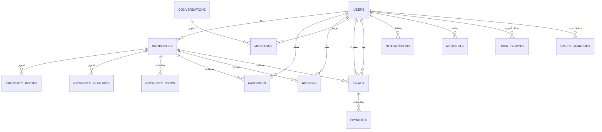
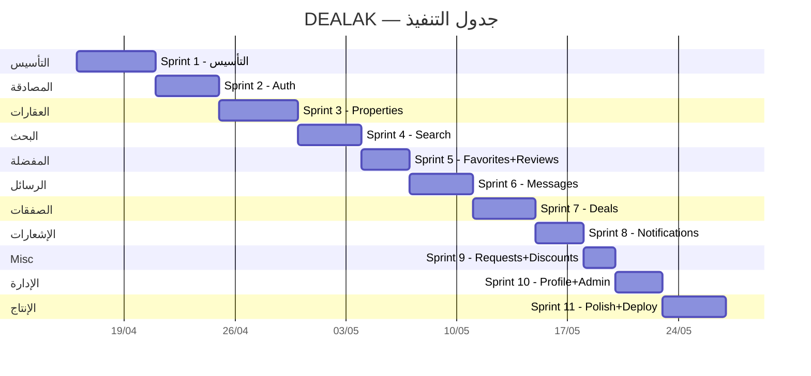

# 🏗️ DEALAK — خطة التنفيذ الشاملة (Laravel + Flutter)

> **تاريخ الإنشاء:** 15 أبريل 2026
> **المشروع:** DEALAK — منصة العقارات في سوريا
> **Backend:** Laravel 12 + PostgreSQL + PostGIS + Redis
> **Frontend Mobile:** Flutter (iOS + Android)
> **Frontend Web:** Flutter Web
> **المصادقة:** Laravel Sanctum (Token-based)
> **التخزين:** S3-compatible (Cloudflare R2 أو AWS S3)
> **Real-time:** Laravel Reverb (WebSocket) + Firebase Cloud Messaging

---

## 📋 فهرس المحتويات

1. [الرؤية والأهداف](#-الرؤية-والأهداف)
2. [البنية المعمارية](#-البنية-المعمارية)
3. [هيكل مشروع Laravel](#-هيكل-مشروع-laravel-backend)
4. [هيكل مشروع Flutter](#-هيكل-مشروع-flutter)
5. [قاعدة البيانات](#-قاعدة-البيانات)
6. [API Endpoints](#-api-endpoints)
7. [نظام المصادقة](#-نظام-المصادقة)
8. [الميزات التفصيلية](#-الميزات-التفصيلية)
9. [خطة التنفيذ المرحلية](#-خطة-التنفيذ-المرحلية)
10. [أفضل الممارسات](#-أفضل-الممارسات)
11. [خطة النشر](#-خطة-النشر)

---

## 🎯 الرؤية والأهداف

### ماهو DEALAK؟
منصة عقارية شاملة مخصصة للسوق السورية، تتيح للمستخدمين البحث عن العقارات وعرضها وإدارة الصفقات العقارية بكافة أنواعها (بيع، إيجار شهري/سنوي/يومي).

### الأهداف التقنية
- ✅ API قوي وآمن مبني على Laravel 12
- ✅ تطبيق Flutter موحد (Mobile + Web)
- ✅ بحث مكاني عبر PostGIS
- ✅ إشعارات فورية (Push Notifications)
- ✅ محادثات مباشرة Real-time
- ✅ نظام صفقات ومدفوعات متكامل
- ✅ لوحة تحكم إدارية (Admin Panel)

---

## 🏛️ البنية المعمارية

```
┌──────────────────────────────────────────────────────────┐
│                    Flutter Client                        │
│  ┌──────────┐  ┌──────────┐  ┌────────────────────────┐  │
│  │  Mobile   │  │  Mobile  │  │      Flutter Web       │  │
│  │  (iOS)    │  │ (Android)│  │   (Browser SPA)        │  │
│  └────┬─────┘  └────┬─────┘  └───────────┬────────────┘  │
│       │              │                    │               │
│       └──────────────┴────────────────────┘               │
│                      │                                    │
│              Dio HTTP Client                              │
│              + WebSocket Client                           │
└──────────────┬───────────────────────────────────────────┘
               │ HTTPS / WSS
               ▼
┌──────────────────────────────────────────────────────────┐
│                 Laravel 12 Backend                        │
│  ┌──────────────────────────────────────────────────┐    │
│  │            Sanctum Authentication                │    │
│  ├──────────────────────────────────────────────────┤    │
│  │           API Routes (v1)                        │    │
│  │  /auth  /properties  /users  /deals  /messages   │    │
│  │  /reviews  /favorites  /notifications  /payments │    │
│  ├──────────────────────────────────────────────────┤    │
│  │       Controllers → Services → Repositories      │    │
│  ├──────────────────────────────────────────────────┤    │
│  │  Form Requests │ Resources │ Policies │ Events   │    │
│  ├──────────────────────────────────────────────────┤    │
│  │         Eloquent ORM + PostGIS                   │    │
│  └──────────┬──────────────┬────────────────────────┘    │
│             │              │                             │
│  ┌──────────▼──┐  ┌───────▼─────┐  ┌────────────────┐   │
│  │ PostgreSQL  │  │    Redis    │  │  S3/R2 Storage │   │
│  │  + PostGIS  │  │ Cache+Queue │  │   (Images)     │   │
│  └─────────────┘  └─────────────┘  └────────────────┘   │
│             │                                            │
│  ┌──────────▼──────────────────────────────────────┐     │
│  │  Laravel Reverb (WebSocket) + FCM (Push)        │     │
│  └─────────────────────────────────────────────────┘     │
└──────────────────────────────────────────────────────────┘
```

---

## 📁 هيكل مشروع Laravel (Backend)

```
dealak-backend/
├── app/
│   ├── Console/
│   │   └── Commands/
│   │       ├── CleanExpiredTokens.php      # تنظيف tokens منتهية
│   │       ├── SendPropertyAlerts.php      # إرسال تنبيهات البحوث المحفوظة
│   │       └── GenerateSitemap.php         # خريطة الموقع
│   │
│   ├── Events/
│   │   ├── PropertyCreated.php
│   │   ├── PropertyViewed.php
│   │   ├── DealStatusChanged.php
│   │   ├── MessageSent.php
│   │   └── NewNotification.php
│   │
│   ├── Exceptions/
│   │   └── Handler.php                     # معالج أخطاء موحد + API responses
│   │
│   ├── Http/
│   │   ├── Controllers/
│   │   │   └── Api/
│   │   │       └── V1/
│   │   │           ├── AuthController.php
│   │   │           ├── PropertyController.php
│   │   │           ├── UserController.php
│   │   │           ├── FavoriteController.php
│   │   │           ├── MessageController.php
│   │   │           ├── ConversationController.php
│   │   │           ├── DealController.php
│   │   │           ├── PaymentController.php
│   │   │           ├── ReviewController.php
│   │   │           ├── NotificationController.php
│   │   │           ├── RequestController.php      # طلبات عقارية
│   │   │           ├── DiscountController.php
│   │   │           ├── SearchController.php        # بحث متقدم + PostGIS
│   │   │           └── AdminController.php         # لوحة التحكم
│   │   │
│   │   ├── Middleware/
│   │   │   ├── ForceJsonResponse.php       # إجبار JSON response
│   │   │   ├── SetLocale.php               # لغة التطبيق (ar/en)
│   │   │   └── TrackPropertyView.php       # تتبع مشاهدات العقار
│   │   │
│   │   ├── Requests/
│   │   │   ├── Auth/
│   │   │   │   ├── LoginRequest.php
│   │   │   │   ├── RegisterRequest.php
│   │   │   │   ├── ForgotPasswordRequest.php
│   │   │   │   └── ResetPasswordRequest.php
│   │   │   ├── Property/
│   │   │   │   ├── StorePropertyRequest.php
│   │   │   │   ├── UpdatePropertyRequest.php
│   │   │   │   └── SearchPropertyRequest.php
│   │   │   ├── Deal/
│   │   │   │   ├── StoreDealRequest.php
│   │   │   │   └── UpdateDealRequest.php
│   │   │   ├── Message/
│   │   │   │   └── SendMessageRequest.php
│   │   │   ├── Review/
│   │   │   │   └── StoreReviewRequest.php
│   │   │   └── Request/
│   │   │       └── StoreRequestRequest.php
│   │   │
│   │   └── Resources/
│   │       ├── PropertyResource.php
│   │       ├── PropertyCollection.php
│   │       ├── UserResource.php
│   │       ├── DealResource.php
│   │       ├── MessageResource.php
│   │       ├── ConversationResource.php
│   │       ├── ReviewResource.php
│   │       ├── NotificationResource.php
│   │       └── FavoriteResource.php
│   │
│   ├── Listeners/
│   │   ├── SendNewPropertyNotification.php
│   │   ├── LogPropertyView.php
│   │   ├── SendDealStatusNotification.php
│   │   ├── BroadcastMessage.php
│   │   └── SendPushNotification.php
│   │
│   ├── Models/
│   │   ├── User.php
│   │   ├── Property.php
│   │   ├── PropertyImage.php
│   │   ├── PropertyFeature.php
│   │   ├── PropertyView.php
│   │   ├── Favorite.php
│   │   ├── SavedSearch.php
│   │   ├── Conversation.php
│   │   ├── Message.php
│   │   ├── Deal.php
│   │   ├── Payment.php
│   │   ├── Review.php
│   │   ├── Notification.php
│   │   ├── Request.php
│   │   ├── Discount.php
│   │   ├── UserDevice.php
│   │   ├── RefreshToken.php
│   │   ├── AuditLog.php
│   │   └── SystemSetting.php
│   │
│   ├── Notifications/
│   │   ├── NewMessageNotification.php
│   │   ├── DealUpdateNotification.php
│   │   ├── PropertyMatchNotification.php
│   │   └── WelcomeNotification.php
│   │
│   ├── Observers/
│   │   ├── PropertyObserver.php            # auto slug, audit log
│   │   ├── DealObserver.php                # status change events
│   │   └── UserObserver.php                # welcome email
│   │
│   ├── Policies/
│   │   ├── PropertyPolicy.php
│   │   ├── DealPolicy.php
│   │   ├── MessagePolicy.php
│   │   ├── ReviewPolicy.php
│   │   └── UserPolicy.php
│   │
│   ├── Scopes/
│   │   ├── ActiveScope.php                 # where is_active = true
│   │   └── NotDeletedScope.php             # where deleted_at is null
│   │
│   ├── Services/
│   │   ├── AuthService.php
│   │   ├── PropertyService.php
│   │   ├── SearchService.php               # PostGIS spatial queries
│   │   ├── DealService.php
│   │   ├── MessageService.php
│   │   ├── NotificationService.php
│   │   ├── PaymentService.php
│   │   ├── ImageService.php                # S3 upload + resize
│   │   ├── FCMService.php                  # Push notifications
│   │   └── AuditService.php
│   │
│   └── Traits/
│       ├── HasSlug.php
│       ├── Auditable.php
│       └── SoftDeletesWithUser.php
│
├── config/
│   ├── sanctum.php
│   ├── cors.php
│   ├── filesystems.php                     # S3/R2 config
│   └── broadcasting.php                    # Reverb config
│
├── database/
│   ├── factories/
│   │   ├── UserFactory.php
│   │   ├── PropertyFactory.php
│   │   ├── DealFactory.php
│   │   └── ReviewFactory.php
│   │
│   ├── migrations/
│   │   ├── 0001_create_users_table.php
│   │   ├── 0002_create_user_devices_table.php
│   │   ├── 0003_create_refresh_tokens_table.php
│   │   ├── 0004_create_properties_table.php
│   │   ├── 0005_create_property_images_table.php
│   │   ├── 0006_create_property_features_table.php
│   │   ├── 0007_create_property_views_table.php
│   │   ├── 0008_create_favorites_table.php
│   │   ├── 0009_create_saved_searches_table.php
│   │   ├── 0010_create_conversations_table.php
│   │   ├── 0011_create_messages_table.php
│   │   ├── 0012_create_requests_table.php
│   │   ├── 0013_create_deals_table.php
│   │   ├── 0014_create_payments_table.php
│   │   ├── 0015_create_discounts_table.php
│   │   ├── 0016_create_reviews_table.php
│   │   ├── 0017_create_notifications_table.php
│   │   ├── 0018_create_audit_logs_table.php
│   │   ├── 0019_create_system_settings_table.php
│   │   └── 0020_add_postgis_to_properties.php     # PostGIS point column
│   │
│   └── seeders/
│       ├── DatabaseSeeder.php
│       ├── UserSeeder.php
│       ├── PropertySeeder.php
│       ├── SystemSettingSeeder.php
│       └── GovernorateSeeder.php           # محافظات سوريا
│
├── routes/
│   ├── api.php                             # v1 API routes
│   ├── channels.php                        # WebSocket channels
│   └── console.php                         # Scheduled commands
│
├── tests/
│   ├── Feature/
│   │   ├── Auth/
│   │   │   ├── LoginTest.php
│   │   │   ├── RegisterTest.php
│   │   │   └── PasswordResetTest.php
│   │   ├── Property/
│   │   │   ├── PropertyCrudTest.php
│   │   │   ├── PropertySearchTest.php
│   │   │   └── PropertyImageTest.php
│   │   ├── Deal/
│   │   │   └── DealFlowTest.php
│   │   └── Message/
│   │       └── ConversationTest.php
│   └── Unit/
│       ├── Services/
│       │   ├── SearchServiceTest.php
│       │   └── DealServiceTest.php
│       └── Models/
│           ├── PropertyTest.php
│           └── UserTest.php
│
├── docker-compose.yml
├── Dockerfile
├── .env.example
├── phpunit.xml
└── composer.json
```

---

## 📁 هيكل مشروع Flutter

```
dealak_flutter/
├── android/
├── ios/
├── web/
│
├── lib/
│   │
│   ├── main.dart                           # Entry point + providers setup
│   ├── app.dart                            # MaterialApp + routing
│   │
│   ├── core/
│   │   ├── constants/
│   │   │   ├── app_colors.dart             # ألوان التصميم
│   │   │   ├── app_typography.dart         # الخطوط والأحجام
│   │   │   ├── app_spacing.dart            # المسافات
│   │   │   ├── app_assets.dart             # مسارات الأيقونات والصور
│   │   │   ├── api_endpoints.dart          # API URLs
│   │   │   └── app_strings_ar.dart         # النصوص العربية
│   │   │
│   │   ├── theme/
│   │   │   ├── app_theme.dart              # ThemeData (light + dark)
│   │   │   └── custom_widgets_theme.dart   # ثيمات مخصصة
│   │   │
│   │   ├── network/
│   │   │   ├── dio_client.dart             # Dio instance + interceptors
│   │   │   ├── api_interceptor.dart        # Auth token interceptor
│   │   │   ├── error_interceptor.dart      # Error handling
│   │   │   ├── api_response.dart           # Generic response wrapper
│   │   │   └── api_exceptions.dart         # Custom exceptions
│   │   │
│   │   ├── storage/
│   │   │   ├── secure_storage.dart         # flutter_secure_storage
│   │   │   └── preferences.dart            # SharedPreferences
│   │   │
│   │   ├── router/
│   │   │   ├── app_router.dart             # GoRouter configuration
│   │   │   ├── route_names.dart            # Named routes
│   │   │   └── auth_guard.dart             # حماية routes المصادقة
│   │   │
│   │   ├── utils/
│   │   │   ├── validators.dart             # Input validation
│   │   │   ├── formatters.dart             # Currency, date, area formatting
│   │   │   ├── debouncer.dart              # Search debouncing
│   │   │   ├── image_utils.dart            # Image compression
│   │   │   └── location_utils.dart         # GPS helper
│   │   │
│   │   └── extensions/
│   │       ├── context_extensions.dart     # BuildContext helpers
│   │       ├── string_extensions.dart
│   │       └── num_extensions.dart
│   │
│   ├── data/
│   │   ├── models/
│   │   │   ├── user_model.dart
│   │   │   ├── property_model.dart
│   │   │   ├── property_image_model.dart
│   │   │   ├── property_feature_model.dart
│   │   │   ├── deal_model.dart
│   │   │   ├── message_model.dart
│   │   │   ├── conversation_model.dart
│   │   │   ├── review_model.dart
│   │   │   ├── notification_model.dart
│   │   │   ├── favorite_model.dart
│   │   │   ├── payment_model.dart
│   │   │   ├── request_model.dart          # طلبات عقارية
│   │   │   ├── discount_model.dart
│   │   │   ├── search_filter_model.dart
│   │   │   └── pagination_model.dart
│   │   │
│   │   ├── repositories/
│   │   │   ├── auth_repository.dart
│   │   │   ├── property_repository.dart
│   │   │   ├── user_repository.dart
│   │   │   ├── favorite_repository.dart
│   │   │   ├── message_repository.dart
│   │   │   ├── deal_repository.dart
│   │   │   ├── review_repository.dart
│   │   │   ├── notification_repository.dart
│   │   │   ├── payment_repository.dart
│   │   │   ├── request_repository.dart
│   │   │   └── search_repository.dart
│   │   │
│   │   └── datasources/
│   │       ├── remote/
│   │       │   ├── auth_remote_datasource.dart
│   │       │   ├── property_remote_datasource.dart
│   │       │   ├── user_remote_datasource.dart
│   │       │   ├── favorite_remote_datasource.dart
│   │       │   ├── message_remote_datasource.dart
│   │       │   ├── deal_remote_datasource.dart
│   │       │   ├── review_remote_datasource.dart
│   │       │   ├── notification_remote_datasource.dart
│   │       │   ├── payment_remote_datasource.dart
│   │       │   └── search_remote_datasource.dart
│   │       │
│   │       └── local/
│   │           ├── auth_local_datasource.dart      # Token storage
│   │           ├── property_local_datasource.dart   # Offline cache
│   │           └── favorites_local_datasource.dart
│   │
│   ├── providers/
│   │   ├── auth_provider.dart              # Riverpod auth state
│   │   ├── property_provider.dart          # Properties state
│   │   ├── search_provider.dart            # Search & filters state
│   │   ├── favorite_provider.dart
│   │   ├── message_provider.dart
│   │   ├── deal_provider.dart
│   │   ├── review_provider.dart
│   │   ├── notification_provider.dart
│   │   ├── theme_provider.dart             # Dark/Light mode
│   │   └── locale_provider.dart            # AR/EN
│   │
│   ├── features/
│   │   │
│   │   ├── auth/
│   │   │   ├── screens/
│   │   │   │   ├── login_screen.dart
│   │   │   │   ├── register_screen.dart
│   │   │   │   ├── forgot_password_screen.dart
│   │   │   │   ├── reset_password_screen.dart
│   │   │   │   └── otp_verification_screen.dart
│   │   │   └── widgets/
│   │   │       ├── auth_form_field.dart
│   │   │       ├── social_login_buttons.dart
│   │   │       └── role_selector.dart
│   │   │
│   │   ├── onboarding/
│   │   │   └── screens/
│   │   │       └── onboarding_screen.dart
│   │   │
│   │   ├── home/
│   │   │   ├── screens/
│   │   │   │   └── home_screen.dart
│   │   │   └── widgets/
│   │   │       ├── hero_search_bar.dart
│   │   │       ├── featured_properties_carousel.dart
│   │   │       ├── category_chips.dart
│   │   │       ├── nearby_properties_map.dart
│   │   │       ├── stats_section.dart
│   │   │       └── recent_properties_list.dart
│   │   │
│   │   ├── property/
│   │   │   ├── screens/
│   │   │   │   ├── property_list_screen.dart
│   │   │   │   ├── property_detail_screen.dart
│   │   │   │   ├── property_create_screen.dart
│   │   │   │   ├── property_edit_screen.dart
│   │   │   │   └── property_gallery_screen.dart
│   │   │   └── widgets/
│   │   │       ├── property_card.dart
│   │   │       ├── property_card_horizontal.dart
│   │   │       ├── property_image_slider.dart
│   │   │       ├── property_info_row.dart
│   │   │       ├── property_features_grid.dart
│   │   │       ├── property_map_view.dart
│   │   │       ├── property_contact_bar.dart
│   │   │       ├── property_reviews_section.dart
│   │   │       ├── similar_properties.dart
│   │   │       └── image_picker_sheet.dart
│   │   │
│   │   ├── search/
│   │   │   ├── screens/
│   │   │   │   ├── search_screen.dart
│   │   │   │   ├── search_results_screen.dart
│   │   │   │   ├── map_search_screen.dart
│   │   │   │   └── saved_searches_screen.dart
│   │   │   └── widgets/
│   │   │       ├── search_filters_sheet.dart
│   │   │       ├── price_range_slider.dart
│   │   │       ├── area_range_slider.dart
│   │   │       ├── governorate_picker.dart
│   │   │       ├── property_type_selector.dart
│   │   │       ├── listing_type_selector.dart
│   │   │       ├── bedrooms_selector.dart
│   │   │       └── sort_options_sheet.dart
│   │   │
│   │   ├── favorites/
│   │   │   ├── screens/
│   │   │   │   └── favorites_screen.dart
│   │   │   └── widgets/
│   │   │       └── favorite_toggle_button.dart
│   │   │
│   │   ├── messages/
│   │   │   ├── screens/
│   │   │   │   ├── conversations_screen.dart
│   │   │   │   └── chat_screen.dart
│   │   │   └── widgets/
│   │   │       ├── conversation_tile.dart
│   │   │       ├── message_bubble.dart
│   │   │       ├── chat_input_bar.dart
│   │   │       └── property_preview_card.dart
│   │   │
│   │   ├── deals/
│   │   │   ├── screens/
│   │   │   │   ├── deals_list_screen.dart
│   │   │   │   └── deal_detail_screen.dart
│   │   │   └── widgets/
│   │   │       ├── deal_card.dart
│   │   │       ├── deal_status_badge.dart
│   │   │       ├── deal_timeline.dart
│   │   │       └── payment_section.dart
│   │   │
│   │   ├── profile/
│   │   │   ├── screens/
│   │   │   │   ├── profile_screen.dart
│   │   │   │   ├── edit_profile_screen.dart
│   │   │   │   ├── my_properties_screen.dart
│   │   │   │   └── settings_screen.dart
│   │   │   └── widgets/
│   │   │       ├── profile_header.dart
│   │   │       ├── profile_stats.dart
│   │   │       └── settings_tile.dart
│   │   │
│   │   ├── notifications/
│   │   │   ├── screens/
│   │   │   │   └── notifications_screen.dart
│   │   │   └── widgets/
│   │   │       └── notification_tile.dart
│   │   │
│   │   ├── requests/
│   │   │   ├── screens/
│   │   │   │   ├── requests_list_screen.dart
│   │   │   │   └── create_request_screen.dart
│   │   │   └── widgets/
│   │   │       └── request_card.dart
│   │   │
│   │   └── admin/
│   │       ├── screens/
│   │       │   ├── admin_dashboard_screen.dart
│   │       │   ├── users_management_screen.dart
│   │       │   ├── properties_management_screen.dart
│   │       │   └── reports_screen.dart
│   │       └── widgets/
│   │           ├── stat_card.dart
│   │           └── admin_chart.dart
│   │
│   └── shared/
│       └── widgets/
│           ├── app_scaffold.dart           # scaffold مع bottom nav
│           ├── app_bottom_nav.dart          # BottomNavigationBar
│           ├── app_drawer.dart             # Drawer menu
│           ├── app_app_bar.dart            # AppBar مخصص
│           ├── loading_widget.dart
│           ├── error_widget.dart
│           ├── empty_state_widget.dart
│           ├── shimmer_loading.dart         # Skeleton loading
│           ├── cached_image.dart            # CachedNetworkImage
│           ├── custom_text_field.dart
│           ├── custom_button.dart
│           ├── custom_dropdown.dart
│           ├── price_display.dart           # عرض السعر بالتنسيق السوري
│           ├── property_type_icon.dart
│           ├── rating_stars.dart
│           ├── badge_widget.dart
│           ├── map_widget.dart              # Google/Leaflet map
│           ├── image_gallery.dart
│           ├── pull_to_refresh.dart
│           └── pagination_list.dart         # Infinite scroll
│
├── assets/
│   ├── images/
│   │   ├── logo.png
│   │   ├── logo_dark.png
│   │   ├── onboarding_1.png
│   │   ├── onboarding_2.png
│   │   ├── onboarding_3.png
│   │   ├── placeholder_property.png
│   │   ├── empty_favorites.png
│   │   ├── empty_messages.png
│   │   └── empty_deals.png
│   │
│   ├── icons/
│   │   ├── apartment.svg
│   │   ├── house.svg
│   │   ├── villa.svg
│   │   ├── land.svg
│   │   ├── commercial.svg
│   │   └── building.svg
│   │
│   └── fonts/
│       ├── Tajawal-Regular.ttf
│       ├── Tajawal-Medium.ttf
│       ├── Tajawal-Bold.ttf
│       └── Tajawal-ExtraBold.ttf
│
├── l10n/
│   ├── app_ar.arb                          # الترجمة العربية
│   └── app_en.arb                          # الترجمة الإنجليزية
│
├── test/
│   ├── unit/
│   │   ├── models/
│   │   ├── repositories/
│   │   └── providers/
│   ├── widget/
│   │   ├── property_card_test.dart
│   │   └── login_screen_test.dart
│   └── integration/
│       └── auth_flow_test.dart
│
├── analysis_options.yaml
├── pubspec.yaml
└── README.md
```

---

## 🗄️ قاعدة البيانات

### ERD — مخطط العلاقات



### Migrations التفصيلية

#### `0001_create_users_table.php`
```php
Schema::create('users', function (Blueprint $table) {
    $table->id();
    $table->string('email')->unique();
    $table->string('phone')->unique()->nullable();
    $table->string('password');
    $table->string('first_name');
    $table->string('last_name');
    $table->enum('role', ['ADMIN', 'AGENT', 'BUYER', 'SELLER', 'TENANT', 'LANDLORD'])
          ->default('BUYER');
    $table->string('avatar_url')->nullable();
    $table->text('bio')->nullable();
    $table->string('national_id')->unique()->nullable();
    $table->boolean('is_verified')->default(false);
    $table->boolean('is_active')->default(true);
    $table->timestamp('last_login_at')->nullable();
    $table->softDeletes();
    $table->timestamps();

    // Indexes
    $table->index('role');
    $table->index('is_active');
    $table->index(['role', 'is_active']);
    $table->index('last_login_at');
});
```

#### `0004_create_properties_table.php`
```php
Schema::create('properties', function (Blueprint $table) {
    $table->id();
    $table->foreignId('owner_id')->constrained('users');
    $table->foreignId('agent_id')->nullable()->constrained('users');
    $table->string('title');
    $table->string('slug')->unique();
    $table->text('description')->nullable();
    $table->enum('property_type', [
        'APARTMENT', 'HOUSE', 'VILLA', 'LAND',
        'COMMERCIAL', 'OFFICE', 'WAREHOUSE', 'FARM'
    ]);
    $table->enum('status', [
        'AVAILABLE', 'SOLD', 'RENTED', 'PENDING', 'RESERVED', 'DRAFT'
    ])->default('AVAILABLE');
    $table->enum('listing_type', [
        'SALE', 'RENT_MONTHLY', 'RENT_YEARLY', 'RENT_DAILY'
    ]);
    $table->decimal('price', 15, 2);
    $table->string('currency', 3)->default('SYP');
    $table->decimal('area_sqm', 10, 2)->nullable();
    $table->unsignedTinyInteger('bedrooms')->nullable();
    $table->unsignedTinyInteger('bathrooms')->nullable();
    $table->unsignedTinyInteger('floors')->nullable();
    $table->unsignedSmallInteger('year_built')->nullable();
    $table->string('address')->nullable();
    $table->string('city');
    $table->string('district')->nullable();
    $table->decimal('latitude', 10, 7)->nullable();
    $table->decimal('longitude', 10, 7)->nullable();
    $table->boolean('is_featured')->default(false);
    $table->boolean('is_negotiable')->default(true);
    $table->unsignedInteger('view_count')->default(0);
    $table->softDeletes();
    $table->timestamps();

    // Indexes
    $table->index('property_type');
    $table->index('status');
    $table->index('listing_type');
    $table->index('price');
    $table->index('city');
    $table->index('is_featured');
    $table->index(['status', 'listing_type']);
    $table->index(['city', 'district']);
});
```

#### `0020_add_postgis_to_properties.php`
```php
// PostGIS spatial column for geo-search
DB::statement('ALTER TABLE properties ADD COLUMN location GEOGRAPHY(Point, 4326)');
DB::statement('CREATE INDEX idx_properties_location ON properties USING GIST(location)');

// Trigger to auto-update location from lat/lng
DB::statement("
    CREATE OR REPLACE FUNCTION update_property_location()
    RETURNS TRIGGER AS $$
    BEGIN
        IF NEW.latitude IS NOT NULL AND NEW.longitude IS NOT NULL THEN
            NEW.location = ST_SetSRID(ST_MakePoint(NEW.longitude, NEW.latitude), 4326);
        END IF;
        RETURN NEW;
    END;
    $$ LANGUAGE plpgsql;

    CREATE TRIGGER trg_update_property_location
    BEFORE INSERT OR UPDATE ON properties
    FOR EACH ROW EXECUTE FUNCTION update_property_location();
");
```

---

## 🔌 API Endpoints

### المصادقة — `/api/v1/auth`

| الطريقة | المسار | الوصف | Auth |
|---------|--------|-------|------|
| `POST` | `/register` | إنشاء حساب جديد | ❌ |
| `POST` | `/login` | تسجيل الدخول | ❌ |
| `POST` | `/logout` | تسجيل الخروج | ✅ |
| `POST` | `/refresh` | تحديث التوكن | ✅ |
| `POST` | `/forgot-password` | نسيت كلمة المرور | ❌ |
| `POST` | `/reset-password` | إعادة تعيين كلمة المرور | ❌ |
| `GET` | `/me` | بيانات المستخدم الحالي | ✅ |
| `POST` | `/verify-email` | تأكيد البريد الإلكتروني | ❌ |
| `POST` | `/google` | تسجيل عبر Google | ❌ |

### العقارات — `/api/v1/properties`

| الطريقة | المسار | الوصف | Auth |
|---------|--------|-------|------|
| `GET` | `/` | قائمة العقارات (مع فلاتر و pagination) | ❌ |
| `GET` | `/{id}` | تفاصيل عقار | ❌ |
| `GET` | `/slug/{slug}` | تفاصيل عقار بالـ slug | ❌ |
| `POST` | `/` | إضافة عقار جديد | ✅ Seller/Agent |
| `PUT` | `/{id}` | تعديل عقار | ✅ Owner/Agent |
| `DELETE` | `/{id}` | حذف عقار (soft delete) | ✅ Owner/Admin |
| `POST` | `/{id}/images` | رفع صور العقار | ✅ Owner |
| `DELETE` | `/{id}/images/{imageId}` | حذف صورة | ✅ Owner |
| `GET` | `/featured` | العقارات المميزة | ❌ |
| `GET` | `/my` | عقاراتي | ✅ |
| `GET` | `/{id}/similar` | عقارات مشابهة | ❌ |

### البحث — `/api/v1/search`

| الطريقة | المسار | الوصف | Auth |
|---------|--------|-------|------|
| `GET` | `/` | بحث متقدم (مع فلاتر) | ❌ |
| `GET` | `/nearby` | بحث مكاني (PostGIS) `?lat=&lng=&radius=` | ❌ |
| `GET` | `/suggestions` | اقتراحات البحث (autocomplete) | ❌ |
| `GET` | `/saved` | البحوث المحفوظة | ✅ |
| `POST` | `/saved` | حفظ بحث جديد | ✅ |
| `DELETE` | `/saved/{id}` | حذف بحث محفوظ | ✅ |

### المفضلة — `/api/v1/favorites`

| الطريقة | المسار | الوصف | Auth |
|---------|--------|-------|------|
| `GET` | `/` | قائمة المفضلة | ✅ |
| `POST` | `/` | إضافة للمفضلة `{propertyId}` | ✅ |
| `DELETE` | `/{propertyId}` | إزالة من المفضلة | ✅ |
| `GET` | `/check/{propertyId}` | هل في المفضلة؟ | ✅ |

### الرسائل — `/api/v1/conversations`

| الطريقة | المسار | الوصف | Auth |
|---------|--------|-------|------|
| `GET` | `/` | قائمة المحادثات | ✅ |
| `POST` | `/` | بدء محادثة جديدة `{userId, propertyId?}` | ✅ |
| `GET` | `/{id}/messages` | رسائل محادثة | ✅ |
| `POST` | `/{id}/messages` | إرسال رسالة | ✅ |
| `PUT` | `/{id}/read` | تعليم كمقروءة | ✅ |

### الصفقات — `/api/v1/deals`

| الطريقة | المسار | الوصف | Auth |
|---------|--------|-------|------|
| `GET` | `/` | قائمة الصفقات | ✅ |
| `GET` | `/{id}` | تفاصيل صفقة | ✅ |
| `POST` | `/` | إنشاء صفقة | ✅ |
| `PUT` | `/{id}` | تحديث حالة الصفقة | ✅ |
| `POST` | `/{id}/payments` | تسجيل دفعة | ✅ |
| `GET` | `/{id}/payments` | سجل المدفوعات | ✅ |

### التقييمات — `/api/v1/reviews`

| الطريقة | المسار | الوصف | Auth |
|---------|--------|-------|------|
| `GET` | `/property/{propertyId}` | تقييمات عقار | ❌ |
| `POST` | `/` | إضافة تقييم | ✅ |
| `PUT` | `/{id}` | تعديل تقييم | ✅ Owner |
| `DELETE` | `/{id}` | حذف تقييم | ✅ Owner/Admin |

### الإشعارات — `/api/v1/notifications`

| الطريقة | المسار | الوصف | Auth |
|---------|--------|-------|------|
| `GET` | `/` | قائمة الإشعارات | ✅ |
| `PUT` | `/{id}/read` | تعليم كمقروء | ✅ |
| `PUT` | `/read-all` | تعليم الكل كمقروء | ✅ |
| `GET` | `/unread-count` | عدد غير المقروءة | ✅ |
| `POST` | `/device-token` | تسجيل device token (FCM) | ✅ |

### الطلبات العقارية — `/api/v1/requests`

| الطريقة | المسار | الوصف | Auth |
|---------|--------|-------|------|
| `GET` | `/` | قائمة الطلبات | ✅ |
| `POST` | `/` | إنشاء طلب عقاري | ✅ |
| `PUT` | `/{id}` | تعديل طلب | ✅ Owner |
| `DELETE` | `/{id}` | إلغاء طلب | ✅ Owner |

### المستخدمون — `/api/v1/users`

| الطريقة | المسار | الوصف | Auth |
|---------|--------|-------|------|
| `GET` | `/{id}` | ملف مستخدم عام | ❌ |
| `PUT` | `/profile` | تحديث الملف الشخصي | ✅ |
| `POST` | `/avatar` | رفع صورة شخصية | ✅ |
| `PUT` | `/password` | تغيير كلمة المرور | ✅ |

### الإدارة — `/api/v1/admin` (Admin فقط)

| الطريقة | المسار | الوصف | Auth |
|---------|--------|-------|------|
| `GET` | `/dashboard` | إحصائيات عامة | ✅ Admin |
| `GET` | `/users` | إدارة المستخدمين | ✅ Admin |
| `PUT` | `/users/{id}/status` | تفعيل/تعطيل مستخدم | ✅ Admin |
| `GET` | `/properties/pending` | عقارات بانتظار المراجعة | ✅ Admin |
| `PUT` | `/properties/{id}/approve` | قبول عقار | ✅ Admin |
| `GET` | `/reports` | تقارير | ✅ Admin |

---

## 🔐 نظام المصادقة

### Laravel Sanctum — Token-based

```php
// AuthController.php

public function register(RegisterRequest $request): JsonResponse
{
    $user = User::create([
        'first_name' => $request->first_name,
        'last_name'  => $request->last_name,
        'email'      => $request->email,
        'phone'      => $request->phone,
        'password'   => Hash::make($request->password),
        'role'       => $request->role ?? 'BUYER',
    ]);

    $token = $user->createToken('auth-token', [$user->role])->plainTextToken;

    return response()->json([
        'user'  => new UserResource($user),
        'token' => $token,
    ], 201);
}

public function login(LoginRequest $request): JsonResponse
{
    $user = User::where('email', $request->email)->first();

    if (!$user || !Hash::check($request->password, $user->password)) {
        throw ValidationException::withMessages([
            'email' => ['بيانات الدخول غير صحيحة.'],
        ]);
    }

    if (!$user->is_active) {
        return response()->json(['message' => 'الحساب معطّل'], 403);
    }

    // حذف tokens قديمة (جهاز واحد فقط)
    // $user->tokens()->delete();  // إلغاء التعليق لسياسة جهاز واحد

    $token = $user->createToken('auth-token', [$user->role])->plainTextToken;

    $user->update(['last_login_at' => now()]);

    return response()->json([
        'user'  => new UserResource($user),
        'token' => $token,
    ]);
}
```

### Flutter Dio Client — Token Management

```dart
// dio_client.dart

class DioClient {
  late Dio _dio;
  final SecureStorage _storage;

  DioClient(this._storage) {
    _dio = Dio(BaseOptions(
      baseUrl: ApiEndpoints.baseUrl,
      connectTimeout: const Duration(seconds: 30),
      receiveTimeout: const Duration(seconds: 30),
      headers: {
        'Accept': 'application/json',
        'Content-Type': 'application/json',
      },
    ));

    _dio.interceptors.addAll([
      _authInterceptor(),
      _errorInterceptor(),
      LogInterceptor(requestBody: true, responseBody: true),
    ]);
  }

  Interceptor _authInterceptor() {
    return InterceptorsWrapper(
      onRequest: (options, handler) async {
        final token = await _storage.getToken();
        if (token != null) {
          options.headers['Authorization'] = 'Bearer $token';
        }
        handler.next(options);
      },
      onError: (error, handler) async {
        if (error.response?.statusCode == 401) {
          await _storage.clearAll();
          // Navigate to login
        }
        handler.next(error);
      },
    );
  }
}
```

---

## 🎨 الميزات التفصيلية

### 1. البحث المكاني (PostGIS)

```php
// SearchService.php

public function searchNearby(float $lat, float $lng, float $radiusKm, array $filters = [])
{
    return Property::query()
        ->whereRaw("ST_DWithin(
            location,
            ST_SetSRID(ST_MakePoint(?, ?), 4326)::geography,
            ?
        )", [$lng, $lat, $radiusKm * 1000])
        ->selectRaw("*, ST_Distance(
            location,
            ST_SetSRID(ST_MakePoint(?, ?), 4326)::geography
        ) as distance_meters", [$lng, $lat])
        ->when($filters['property_type'] ?? null, fn($q, $type) => $q->where('property_type', $type))
        ->when($filters['listing_type'] ?? null, fn($q, $type) => $q->where('listing_type', $type))
        ->when($filters['min_price'] ?? null, fn($q, $min) => $q->where('price', '>=', $min))
        ->when($filters['max_price'] ?? null, fn($q, $max) => $q->where('price', '<=', $max))
        ->where('status', 'AVAILABLE')
        ->orderBy('distance_meters')
        ->paginate($filters['limit'] ?? 20);
}
```

### 2. نظام الرسائل Real-time (Laravel Reverb)

```php
// MessageSent event
class MessageSent implements ShouldBroadcast
{
    public function __construct(public Message $message) {}

    public function broadcastOn(): array
    {
        return [
            new PrivateChannel("conversation.{$this->message->conversation_id}"),
        ];
    }

    public function broadcastWith(): array
    {
        return [
            'message' => new MessageResource($this->message),
        ];
    }
}
```

```dart
// Flutter WebSocket listener
class ChatProvider extends StateNotifier<ChatState> {
  late WebSocketChannel _channel;

  void connectToConversation(int conversationId, String token) {
    _channel = WebSocketChannel.connect(
      Uri.parse('wss://api.dealak.com/ws?token=$token'),
    );

    _channel.stream.listen((data) {
      final message = MessageModel.fromJson(jsonDecode(data));
      state = state.copyWith(
        messages: [...state.messages, message],
      );
    });
  }
}
```

### 3. Push Notifications (FCM)

```php
// FCMService.php
class FCMService
{
    public function sendToUser(User $user, string $title, string $body, array $data = [])
    {
        $devices = $user->devices()->where('is_active', true)->get();

        foreach ($devices as $device) {
            Http::withHeaders([
                'Authorization' => 'Bearer ' . $this->getAccessToken(),
                'Content-Type' => 'application/json',
            ])->post('https://fcm.googleapis.com/v1/projects/' . config('services.fcm.project_id') . '/messages:send', [
                'message' => [
                    'token' => $device->device_token,
                    'notification' => [
                        'title' => $title,
                        'body'  => $body,
                    ],
                    'data' => $data,
                ],
            ]);
        }
    }
}
```

### 4. رفع الصور مع Resize

```php
// ImageService.php
class ImageService
{
    public function uploadPropertyImage(UploadedFile $file, Property $property): PropertyImage
    {
        // Original
        $path = $file->store("properties/{$property->id}", 's3');

        // Thumbnail (400x300)
        $thumbnail = Image::make($file)
            ->fit(400, 300)
            ->encode('webp', 80);

        $thumbPath = "properties/{$property->id}/thumbs/" . Str::uuid() . '.webp';
        Storage::disk('s3')->put($thumbPath, $thumbnail);

        return $property->images()->create([
            'image_url'     => Storage::disk('s3')->url($path),
            'thumbnail_url' => Storage::disk('s3')->url($thumbPath),
            'is_primary'    => $property->images()->count() === 0,
            'sort_order'    => $property->images()->count(),
        ]);
    }
}
```

---

## 📦 Dependencies (التبعيات)

### Laravel `composer.json`

```json
{
    "require": {
        "php": "^8.3",
        "laravel/framework": "^12.0",
        "laravel/sanctum": "^4.0",
        "laravel/reverb": "^1.0",
        "intervention/image": "^3.0",
        "league/flysystem-aws-s3-v3": "^3.0",
        "spatie/laravel-query-builder": "^6.0",
        "spatie/laravel-sluggable": "^3.0",
        "spatie/laravel-permission": "^6.0",
        "spatie/laravel-activitylog": "^4.0",
        "kreait/laravel-firebase": "^5.0",
        "mstaack/laravel-postgis": "^5.0"
    },
    "require-dev": {
        "barryvdh/laravel-ide-helper": "^3.0",
        "laravel/pint": "^1.0",
        "pestphp/pest": "^3.0",
        "pestphp/pest-plugin-laravel": "^3.0",
        "laravel/telescope": "^5.0"
    }
}
```

### Flutter `pubspec.yaml`

```yaml
dependencies:
  flutter:
    sdk: flutter

  # State Management
  flutter_riverpod: ^2.6.0
  riverpod_annotation: ^2.3.0

  # Routing
  go_router: ^14.0.0

  # Network
  dio: ^5.7.0
  web_socket_channel: ^3.0.0

  # Storage
  flutter_secure_storage: ^9.2.0
  shared_preferences: ^2.3.0
  hive: ^4.0.0
  hive_flutter: ^1.1.0

  # UI
  cached_network_image: ^3.4.0
  shimmer: ^3.0.0
  flutter_svg: ^2.0.0
  carousel_slider: ^5.0.0
  photo_view: ^0.15.0
  lottie: ^3.0.0
  flutter_animate: ^4.5.0

  # Maps
  google_maps_flutter: ^2.9.0
  geolocator: ^12.0.0
  geocoding: ^3.0.0

  # Forms
  flutter_form_builder: ^9.4.0
  form_builder_validators: ^11.0.0

  # Images
  image_picker: ^1.1.0
  image_cropper: ^8.0.0
  flutter_image_compress: ^2.3.0

  # Push Notifications
  firebase_messaging: ^15.1.0
  flutter_local_notifications: ^17.2.0

  # Utils
  intl: ^0.19.0
  timeago: ^3.7.0
  url_launcher: ^6.3.0
  share_plus: ^10.0.0
  package_info_plus: ^8.0.0
  connectivity_plus: ^6.0.0

  # Code Generation
  freezed_annotation: ^2.4.0
  json_annotation: ^4.9.0

dev_dependencies:
  flutter_test:
    sdk: flutter
  flutter_lints: ^4.0.0
  build_runner: ^2.4.0
  freezed: ^2.5.0
  json_serializable: ^6.8.0
  riverpod_generator: ^2.4.0
  mockito: ^5.4.0
  mocktail: ^1.0.0
```

---

## 🚀 خطة التنفيذ المرحلية

### 🏁 Sprint 1: التأسيس (5 أيام)

#### Laravel
- [ ] إنشاء مشروع Laravel 12 جديد
- [ ] إعداد Docker Compose (PostgreSQL + PostGIS + Redis)
- [ ] تكوين `.env` (database, mail, S3, FCM)
- [ ] تثبيت وتكوين Sanctum
- [ ] إنشاء جميع Migrations (20 ملف)
- [ ] إنشاء جميع Models مع Relations
- [ ] إنشاء Seeders (users, properties, governorates)
- [ ] إعداد API routes skeleton
- [ ] إنشاء `ForceJsonResponse` middleware
- [ ] إعداد Exception Handler لـ JSON responses

#### Flutter
- [ ] إنشاء مشروع Flutter جديد (mobile + web)
- [ ] إعداد هيكل المجلدات (core, data, features, shared)
- [ ] تثبيت جميع dependencies
- [ ] إعداد Dio client + interceptors
- [ ] إعداد GoRouter + auth guard
- [ ] إعداد Riverpod providers skeleton
- [ ] إعداد theme (colors, typography, spacing)
- [ ] إنشاء خط Tajawal + RTL support
- [ ] إنشاء shared widgets أساسية

---

### 🏁 Sprint 2: المصادقة (4 أيام)

#### Laravel
- [ ] `AuthController` كامل (register, login, logout, refresh, me)
- [ ] `RegisterRequest` + `LoginRequest` مع validation عربية
- [ ] `UserResource` لتنسيق الاستجابة
- [ ] `UserPolicy` لصلاحيات المستخدم
- [ ] Password reset flow (email)
- [ ] Email verification
- [ ] Google OAuth (Socialite)
- [ ] Rate limiting على auth routes

#### Flutter
- [ ] Login screen (UI + logic)
- [ ] Register screen مع role selector
- [ ] Forgot password screen
- [ ] Auth provider (Riverpod)
- [ ] Token storage (flutter_secure_storage)
- [ ] Auto-login on app start
- [ ] Onboarding screen (أول مرة)

---

### 🏁 Sprint 3: العقارات — الأساس (5 أيام)

#### Laravel
- [ ] `PropertyController` كامل (CRUD)
- [ ] `StorePropertyRequest` + `UpdatePropertyRequest`
- [ ] `PropertyResource` + `PropertyCollection`
- [ ] `PropertyPolicy` (owner can edit/delete)
- [ ] `PropertyObserver` (auto slug, audit log)
- [ ] Image upload endpoint + `ImageService`
- [ ] Pagination مع `spatie/laravel-query-builder`
- [ ] Sorting + Filtering (type, listing, city, price, area, rooms)
- [ ] Featured properties endpoint
- [ ] My properties endpoint
- [ ] View tracking (`PropertyViewed` event)

#### Flutter
- [ ] Home screen مع hero search + featured carousel
- [ ] Property list screen (infinite scroll)
- [ ] Property card widget
- [ ] Property detail screen (gallery, info, map, contact)
- [ ] Property create screen (multi-step form)
- [ ] Property edit screen
- [ ] Image picker + gallery viewer
- [ ] Property provider (Riverpod)

---

### 🏁 Sprint 4: البحث والتصفية (4 أيام)

#### Laravel
- [ ] `SearchController` مع advanced filters
- [ ] PostGIS nearby search (`ST_DWithin`)
- [ ] Full-text search (PostgreSQL `tsvector`)
- [ ] Saved searches (CRUD)
- [ ] Search suggestions / autocomplete
- [ ] Filter by: type, listing, city, district, price range, area range, rooms, year

#### Flutter
- [ ] Search screen مع instant results
- [ ] Filters bottom sheet
- [ ] Price range slider
- [ ] Area range slider
- [ ] Property type + listing type selectors
- [ ] Governorate picker (dropdown)
- [ ] Bedrooms/bathrooms selector
- [ ] Sort options (price, date, area)
- [ ] Map search screen (Google Maps)
- [ ] Saved searches screen

---

### 🏁 Sprint 5: المفضلة والتقييمات (3 أيام)

#### Laravel
- [ ] `FavoriteController` (add, remove, list, check)
- [ ] `ReviewController` (CRUD)
- [ ] `ReviewPolicy` (one review per user per property)
- [ ] Average rating calculation (cached in Redis)

#### Flutter
- [ ] Favorites screen
- [ ] Favorite toggle button (animated heart)
- [ ] Reviews section in property detail
- [ ] Add review form
- [ ] Rating stars widget

---

### 🏁 Sprint 6: الرسائل والمحادثات (4 أيام)

#### Laravel
- [ ] `ConversationController` (list, create)
- [ ] `MessageController` (list, send, mark read)
- [ ] Laravel Reverb setup (WebSocket)
- [ ] `MessageSent` broadcast event
- [ ] Private channel authorization
- [ ] Unread messages count

#### Flutter
- [ ] Conversations list screen
- [ ] Chat screen (real-time)
- [ ] Message bubble widget
- [ ] Chat input bar
- [ ] WebSocket connection
- [ ] Property preview in chat
- [ ] Online/offline indicator

---

### 🏁 Sprint 7: الصفقات والمدفوعات (4 أيام)

#### Laravel
- [ ] `DealController` (CRUD + status flow)
- [ ] `PaymentController` (record payments)
- [ ] `DealService` (status machine: PENDING → IN_PROGRESS → COMPLETED)
- [ ] `DealObserver` (notifications on status change)
- [ ] Commission calculation
- [ ] Deal timeline

#### Flutter
- [ ] Deals list screen
- [ ] Deal detail screen
- [ ] Deal timeline widget
- [ ] Deal status badge
- [ ] Payment recording form
- [ ] Payment history

---

### 🏁 Sprint 8: الإشعارات (3 أيام)

#### Laravel
- [ ] `NotificationController` (list, read, unread count)
- [ ] FCM integration (`FCMService`)
- [ ] Device token management
- [ ] Notification events (message, deal, property match)
- [ ] Scheduled: send alerts for saved searches

#### Flutter
- [ ] Notifications screen
- [ ] Firebase Messaging setup (iOS + Android)
- [ ] Local notifications
- [ ] Badge count on tab bar
- [ ] Deep linking from notification tap

---

### 🏁 Sprint 9: الطلبات العقارية والخصومات (2 أيام)

#### Laravel
- [ ] `RequestController` (CRUD)
- [ ] `DiscountController` (CRUD + validate code)
- [ ] Matching algorithm (saved searches ↔ new properties)

#### Flutter
- [ ] Property requests screen
- [ ] Create request form
- [ ] Discount code input in deal

---

### 🏁 Sprint 10: الملف الشخصي + الإدارة (3 أيام)

#### Laravel
- [ ] `UserController` (profile update, avatar, password)
- [ ] `AdminController` (dashboard stats, user management, moderation)
- [ ] Admin middleware

#### Flutter
- [ ] Profile screen (header, stats, settings)
- [ ] Edit profile screen
- [ ] Settings screen (theme, language, notifications)
- [ ] My properties screen
- [ ] Admin dashboard (basic stats)

---

### 🏁 Sprint 11: التحسينات والإنتاج (4 أيام)

- [ ] Rate limiting on all endpoints
- [ ] API versioning (`/api/v1/`)
- [ ] Telescope setup (debugging)
- [ ] PHPUnit/Pest tests (auth, properties, deals)
- [ ] Flutter widget tests
- [ ] Flutter integration tests
- [ ] Performance optimization (eager loading, caching)
- [ ] Redis caching strategy
- [ ] API documentation (Scribe/Scramble)
- [ ] Error monitoring (Sentry)
- [ ] CI/CD pipeline
- [ ] App Store + Play Store assets preparation

---

## ✅ أفضل الممارسات

### Laravel

| الممارسة | التفاصيل |
|---------|---------|
| **API Resources** | استخدام `JsonResource` لكل model لتنسيق الاستجابة |
| **Form Requests** | validation منفصل في Request classes مع رسائل عربية |
| **Service Layer** | فصل Business Logic في Services بعيداً عن Controllers |
| **Policies** | Authorization عبر Policies وليس في Controllers |
| **Observers** | Side effects (slug, audit, notifications) في Observers |
| **Events/Listeners** | Async processing عبر Queues |
| **Eager Loading** | `$with` defaults في Models لمنع N+1 |
| **Query Builder** | `spatie/laravel-query-builder` للفلترة والترتيب |
| **Rate Limiting** | `ThrottleRequests` على كل endpoint حسب الحساسية |
| **Soft Deletes** | لا حذف نهائي أبداً، فقط `deleted_at` |
| **Audit Logging** | `spatie/laravel-activitylog` لتتبع كل التغييرات |

### Flutter

| الممارسة | التفاصيل |
|---------|---------|
| **Riverpod** | State management مع `@riverpod` code generation |
| **Freezed** | Immutable data classes مع `fromJson`/`toJson` |
| **GoRouter** | Declarative routing مع auth guards |
| **Repository Pattern** | فصل data sources عن business logic |
| **Dio Interceptors** | Token management + error handling مركزي |
| **Shimmer Loading** | Skeleton loading بدل spinners |
| **Cached Images** | `CachedNetworkImage` لكل صورة |
| **Pagination** | Infinite scroll مع `ScrollController` |
| **Form Validation** | `flutter_form_builder` مع validators عربية |
| **Responsive** | `LayoutBuilder` + breakpoints لـ web |

---

## 🌐 خطة النشر

### البيئات

| البيئة | Backend | Frontend |
|--------|---------|----------|
| **Development** | Docker local | Flutter debug |
| **Staging** | VPS / DigitalOcean | TestFlight + Internal testing |
| **Production** | VPS + CDN | App Store + Play Store + Web |

### Docker Compose (Local Dev)

```yaml
version: '3.8'
services:
  app:
    build: .
    ports:
      - "8000:8000"
    volumes:
      - .:/var/www/html
    depends_on:
      - postgres
      - redis
    environment:
      DB_HOST: postgres
      REDIS_HOST: redis

  postgres:
    image: postgis/postgis:16-3.4
    ports:
      - "5432:5432"
    environment:
      POSTGRES_DB: dealak
      POSTGRES_USER: dealak
      POSTGRES_PASSWORD: secret
    volumes:
      - postgres_data:/var/lib/postgresql/data

  redis:
    image: redis:7-alpine
    ports:
      - "6379:6379"

  mailpit:
    image: axllent/mailpit
    ports:
      - "8025:8025"
      - "1025:1025"

volumes:
  postgres_data:
```

---

## 📊 الجدول الزمني



**المدة الإجمالية المقدّرة:** ~41 يوم عمل (~8 أسابيع)

---

## 📌 ملاحظات ختامية

> [!IMPORTANT]
> هذه الخطة مبنية على تحليل كامل للمشروع الحالي. الانتقال إلى Laravel + Flutter يعني:
> 1. **إعادة كتابة كاملة** — لا يمكن استيراد أي كود من النسخة الحالية
> 2. **D1 SQL Schema** — يمكن استخدامه كمرجع لبناء Migrations
> 3. **API routes الحالية** — يمكن استخدام المنطق كمرجع
> 4. **Frontend/Mobile** — إعادة بناء كاملة بـ Flutter

> [!TIP]
> **الأولوية:** Backend API (Sprint 1-3) → Flutter Core (Sprint 1-3) → يعملان بالتوازي بعدها
