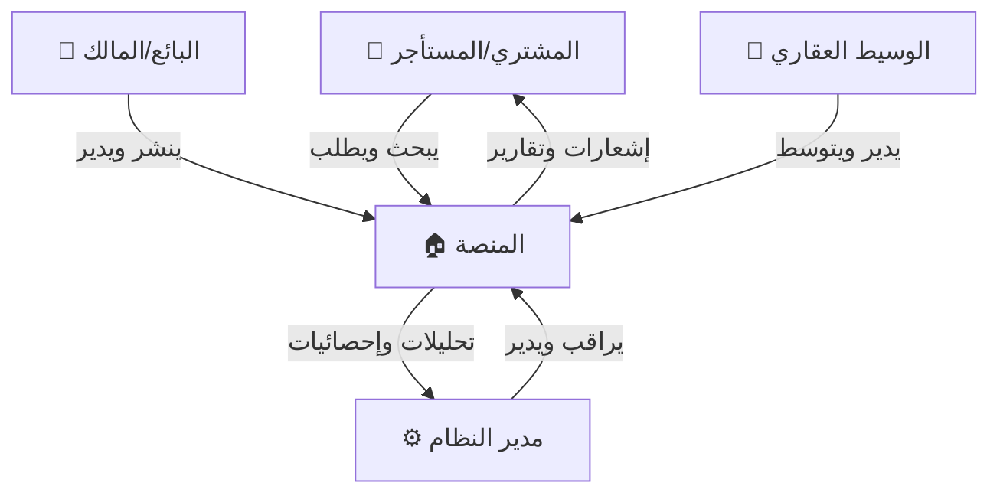
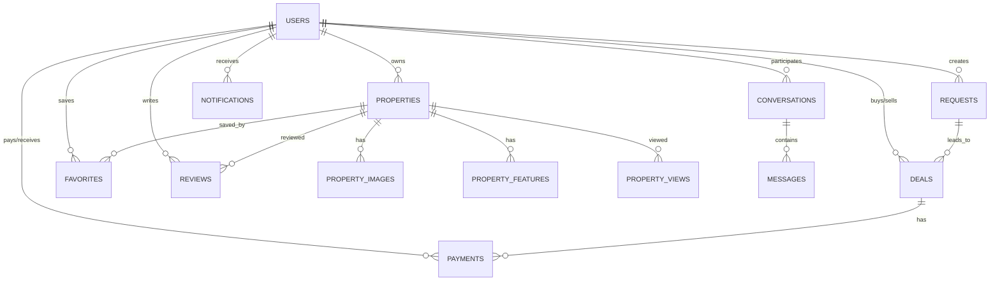

# 🚀 خطة تنفيذ مشروع DEALAK — منصة عقارية متكاملة

> **الإصدار:** 2.0.0  
> **التاريخ:** 11 أبريل 2026  
> **الحالة:** قيد التطوير 🚧  
> **المستودع:** [github.com/abdalganialhamdi-spec/dealak-real-estate-app](https://github.com/abdalganialhamdi-spec/dealak-real-estate-app)

---

## 📋 الفهرس

1. [نظرة عامة](#-نظرة-عامة)
2. [البنية المعمارية](#-البنية-المعمارية-architecture)
3. [التقنيات المختارة](#-التقنيات-المختارة-tech-stack)
4. [هيكل المشروع](#-هيكل-المشروع)
5. [قاعدة البيانات](#-قاعدة-البيانات)
6. [تصميم الـ API](#-تصميم-الـ-api)
7. [نظام الأمان](#-نظام-الأمان)
8. [المراحل الزمنية](#-المراحل-الزمنية)
9. [خطة الاختبار](#-خطة-الاختبار)
10. [خطة النشر](#-خطة-النشر-deployment)
11. [المراقبة والصيانة](#-المراقبة-والصيانة)
12. [خطة التوسع المستقبلية](#-خطة-التوسع-المستقبلية)

---

## 📝 نظرة عامة

### ما هو DEALAK؟

DEALAK هي **منصة عقارية رقمية متكاملة** تهدف إلى تسهيل عملية بيع وإيجار العقارات في **سوريا**. تجمع المنصة بين:

- **تطبيق هاتف ذكي** (iOS + Android) للوصول السريع
- **موقع إلكتروني متجاوب** لتجربة شاملة على الحاسوب
- **لوحة تحكم إدارية** لإدارة النظام والمحتوى

### الأهداف الاستراتيجية

| الهدف | الوصف | مؤشر النجاح |
|-------|-------|-------------|
| 🏠 **تسهيل البحث** | تمكين المستخدمين من إيجاد العقارات بسرعة ودقة | وقت البحث < 5 ثوانٍ |
| 🤝 **ربط الأطراف** | ربط البائعين والمشترين والوسطاء في منصة واحدة | 1000 مستخدم في 3 أشهر |
| 💰 **إتمام الصفقات** | تسهيل وتوثيق الصفقات العقارية | 50 صفقة مكتملة في 3 أشهر |
| 🔒 **الأمان** | حماية بيانات المستخدمين والمعاملات المالية | 0 حوادث أمنية |
| 📈 **التوسع** | بنية قابلة للتوسع لملايين المستخدمين | 99.5% uptime |

### المستخدمون (Actors)



| الدور | المهام الرئيسية |
|-------|----------------|
| **المشتري / المستأجر** | البحث عن العقارات، إرسال طلبات، المفاوضة، الدفع، التقييم |
| **البائع / المالك** | نشر العقارات، إدارة الصور، استلام الطلبات، قبول/رفض، إتمام الصفقات |
| **الوسيط العقاري (Agent)** | إدارة عقارات متعددة، التوسط بين الأطراف، كسب العمولة |
| **مدير النظام (Admin)** | إدارة المستخدمين، مراجعة العقارات، إدارة الخصومات، تتبع الصفقات، التقارير |

---

## 🏗️ البنية المعمارية (Architecture)

### النمط المعماري: Modular Monolith → Microservices-Ready

اخترنا **Modular Monolith** كبنية أولية لأنها توفر:
- سرعة التطوير مع بنية نظيفة
- إمكانية التحويل لـ Microservices عند الحاجة
- أداء عالي بدون overhead الشبكة بين الخدمات

```
┌─────────────────────────────────────────────────────────────┐
│                      CLIENTS                                 │
│  ┌──────────┐  ┌──────────────┐  ┌──────────────────────┐   │
│  │ Mobile   │  │ Web (Next.js)│  │ Admin Dashboard      │   │
│  │ (React   │  │ (SSR + CSR)  │  │ (Next.js)            │   │
│  │  Native) │  └──────┬───────┘  └──────────┬───────────┘   │
│  └────┬─────┘         │                     │               │
│       │               │                     │               │
├───────┴───────────────┴─────────────────────┴───────────────┤
│                     API GATEWAY                              │
│              (Rate Limiting, Auth, CORS)                     │
├──────────────────────────────────────────────────────────────┤
│                   BACKEND (Node.js + Express)                │
│  ┌───────────┐ ┌───────────┐ ┌──────────┐ ┌─────────────┐  │
│  │ Auth      │ │ Property  │ │ Deal     │ │ Notification│  │
│  │ Module    │ │ Module    │ │ Module   │ │ Module      │  │
│  ├───────────┤ ├───────────┤ ├──────────┤ ├─────────────┤  │
│  │ Payment   │ │ Message   │ │ Review   │ │ Analytics   │  │
│  │ Module    │ │ Module    │ │ Module   │ │ Module      │  │
│  └─────┬─────┘ └─────┬─────┘ └────┬─────┘ └──────┬──────┘  │
│        │              │            │               │         │
├────────┴──────────────┴────────────┴───────────────┴─────────┤
│                    DATA LAYER                                 │
│  ┌──────────────┐  ┌─────────┐  ┌──────────┐  ┌──────────┐ │
│  │ PostgreSQL   │  │ Redis   │  │  S3/R2   │  │ Firebase │ │
│  │ + PostGIS    │  │ (Cache) │  │ (Files)  │  │ (Push)   │ │
│  └──────────────┘  └─────────┘  └──────────┘  └──────────┘ │
└──────────────────────────────────────────────────────────────┘
```

### مبادئ التصميم (Design Principles)

| المبدأ | التطبيق |
|--------|---------|
| **Separation of Concerns** | كل Module مستقل بـ Controller + Service + Repository |
| **Repository Pattern** | فصل منطق قاعدة البيانات عن منطق الأعمال |
| **DTO Pattern** | Data Transfer Objects لفصل الـ API عن الـ DB Models |
| **Error Handling** | Custom Error Classes مع HTTP Status Codes محددة |
| **Input Validation** | Zod Schemas في كل Endpoint |
| **Logging** | Structured Logging بـ Winston/Pino |

---

## 🛠️ التقنيات المختارة (Tech Stack)

### Backend

| التقنية | الإصدار | الاستخدام | السبب |
|---------|---------|-----------|-------|
| **Node.js** | 20 LTS | Runtime | أداء عالي، npm ecosystem ضخم |
| **Express.js** | 4.x | HTTP Framework | الأكثر نضجاً واستقراراً |
| **TypeScript** | 5.x | Type Safety | اكتشاف الأخطاء وقت البناء |
| **PostgreSQL** | 16+ | Database | أقوى RDBMS مفتوح المصدر |
| **PostGIS** | 3.x | Spatial Queries | بحث جغرافي متقدم (nearby, radius) |
| **Prisma** | 5.x | ORM | Type-safe queries، migrations تلقائية |
| **Redis** | 7.x | Cache + Pub/Sub | تخزين مؤقت، sessions، real-time |
| **Socket.io** | 4.x | WebSocket | محادثات فورية، إشعارات حية |
| **JWT** | - | Authentication | Stateless، قابل للتوسع |
| **Zod** | 3.x | Validation | Schema validation مع TypeScript |
| **Winston / Pino** | - | Logging | سجلات منظمة JSON |
| **Swagger** | OpenAPI 3.1 | API Docs | توثيق تلقائي للـ API |
| **Jest + Supertest** | - | Testing | Unit + Integration tests |

### Frontend Web

| التقنية | الإصدار | الاستخدام | السبب |
|---------|---------|-----------|-------|
| **Next.js** | 14+ | Framework | SSR + SSG، App Router، SEO ممتاز |
| **React** | 18+ | UI Library | الأكثر شيوعاً، ecosystem ضخم |
| **TypeScript** | 5.x | Type Safety | اتساق مع Backend |
| **Tailwind CSS** | 3.4 | Styling | Utility-first، سريع التطوير |
| **Zustand** | 4.x | State Management | خفيف وبسيط مقارنة بـ Redux |
| **React Query** | 5.x | Server State | تخزين مؤقت ذكي، refetch تلقائي |
| **React Hook Form** | 7.x | Forms | أداء عالي، validation مع Zod |
| **Axios** | 1.x | HTTP Client | Interceptors، retry logic |
| **Leaflet / Mapbox** | - | Maps | خرائط تفاعلية مجانية |
| **Framer Motion** | 11.x | Animations | حركات سلسة |
| **Playwright** | - | E2E Testing | أسرع وأدق من Cypress |

### Mobile App

| التقنية | الإصدار | الاستخدام | السبب |
|---------|---------|-----------|-------|
| **React Native** | 0.74+ | Framework | مشاركة الكود مع الويب |
| **Expo** | 51+ | Build & Dev | تسهيل التطوير والنشر |
| **React Navigation** | 6.x | Navigation | المعيار في React Native |
| **React Query** | 5.x | Server State | نفس المكتبة مع الويب |
| **AsyncStorage** | - | Local Storage | تخزين محلي |
| **react-native-maps** | - | Maps | Google Maps / Apple Maps |
| **Firebase Cloud Messaging** | - | Push Notifications | إشعارات موثوقة |
| **React Native Reanimated** | 3.x | Animations | حركات 60fps |

### DevOps & Infrastructure

| التقنية | الاستخدام | التوصية |
|---------|-----------|---------|
| **Git + GitHub** | Version Control | Trunk-based development |
| **GitHub Actions** | CI/CD | Build → Test → Deploy تلقائي |
| **Docker** | Containerization | بيئات متسقة |
| **Docker Compose** | Local Development | كل الخدمات محلياً |
| **Supabase** | Database (MVP) | PostgreSQL مُدار + Auth جاهز |
| **Vercel** | Frontend Hosting | مثالي لـ Next.js |
| **Railway / Render** | Backend Hosting | سهل ورخيص |
| **Cloudflare R2** | File Storage | صور العقارات، بدون رسوم خروج |
| **Sentry** | Error Tracking | مراقبة الأخطاء |
| **Uptime Robot** | Monitoring | مراقبة التوفر |

---

## 📁 هيكل المشروع

```
dealak-real-estate-app/
│
├── backend/                          # 🖥️ Backend API (Node.js + Express + TypeScript)
│   ├── src/
│   │   ├── config/                   # ⚙️ إعدادات التطبيق
│   │   │   ├── database.ts           #   اتصال PostgreSQL + Prisma
│   │   │   ├── redis.ts              #   اتصال Redis
│   │   │   ├── env.ts                #   متغيرات البيئة (Zod validated)
│   │   │   ├── cors.ts               #   إعدادات CORS
│   │   │   └── swagger.ts            #   إعدادات Swagger/OpenAPI
│   │   │
│   │   ├── modules/                  # 📦 الوحدات (Modular Architecture)
│   │   │   ├── auth/                 #   🔐 المصادقة
│   │   │   │   ├── auth.controller.ts
│   │   │   │   ├── auth.service.ts
│   │   │   │   ├── auth.routes.ts
│   │   │   │   ├── auth.schema.ts    #     Zod validation schemas
│   │   │   │   ├── auth.middleware.ts
│   │   │   │   └── auth.test.ts
│   │   │   │
│   │   │   ├── users/                #   👤 المستخدمون
│   │   │   │   ├── users.controller.ts
│   │   │   │   ├── users.service.ts
│   │   │   │   ├── users.repository.ts
│   │   │   │   ├── users.routes.ts
│   │   │   │   ├── users.schema.ts
│   │   │   │   ├── users.dto.ts      #     Data Transfer Objects
│   │   │   │   └── users.test.ts
│   │   │   │
│   │   │   ├── properties/           #   🏘️ العقارات
│   │   │   │   ├── properties.controller.ts
│   │   │   │   ├── properties.service.ts
│   │   │   │   ├── properties.repository.ts
│   │   │   │   ├── properties.routes.ts
│   │   │   │   ├── properties.schema.ts
│   │   │   │   ├── properties.dto.ts
│   │   │   │   └── properties.test.ts
│   │   │   │
│   │   │   ├── deals/                #   🤝 الصفقات
│   │   │   ├── payments/             #   💳 المدفوعات
│   │   │   ├── requests/             #   📋 الطلبات
│   │   │   ├── messages/             #   💬 الرسائل والمحادثات
│   │   │   ├── notifications/        #   🔔 الإشعارات
│   │   │   ├── reviews/              #   ⭐ التقييمات
│   │   │   ├── favorites/            #   ❤️ المفضلة
│   │   │   ├── discounts/            #   🏷️ الخصومات
│   │   │   ├── upload/               #   📁 رفع الملفات
│   │   │   └── analytics/            #   📊 التحليلات
│   │   │
│   │   ├── middleware/               # 🛡️ Middleware عام
│   │   │   ├── auth.middleware.ts    #   التحقق من JWT
│   │   │   ├── rbac.middleware.ts    #   التحقق من الأدوار
│   │   │   ├── rateLimiter.ts        #   تحديد معدل الطلبات
│   │   │   ├── validator.ts          #   Zod validation wrapper
│   │   │   ├── errorHandler.ts       #   معالج الأخطاء المركزي
│   │   │   ├── logger.ts             #   Request logging
│   │   │   └── upload.ts             #   Multer/Busboy config
│   │   │
│   │   ├── shared/                   # 🔧 مكونات مشتركة
│   │   │   ├── errors/               #   Custom Error Classes
│   │   │   │   ├── AppError.ts
│   │   │   │   ├── NotFoundError.ts
│   │   │   │   ├── UnauthorizedError.ts
│   │   │   │   └── ValidationError.ts
│   │   │   ├── utils/                #   أدوات مساعدة
│   │   │   │   ├── slug.ts           #     توليد slug
│   │   │   │   ├── pagination.ts     #     Cursor/Offset pagination
│   │   │   │   ├── hash.ts           #     bcrypt wrapper
│   │   │   │   └── token.ts          #     JWT helpers
│   │   │   └── types/                #   TypeScript types
│   │   │       ├── express.d.ts
│   │   │       └── common.ts
│   │   │
│   │   ├── jobs/                     # ⏰ Background Jobs
│   │   │   ├── emailNotifier.ts      #   إرسال بريد إلكتروني
│   │   │   ├── savedSearchMatcher.ts #   مطابقة البحوث المحفوظة
│   │   │   └── cleanupExpired.ts     #   تنظيف البيانات المنتهية
│   │   │
│   │   ├── websocket/                # 🔌 WebSocket (Socket.io)
│   │   │   ├── socket.ts            #   إعداد Socket.io
│   │   │   ├── chatHandler.ts       #   معالج المحادثات
│   │   │   └── notificationHandler.ts # معالج الإشعارات الحية
│   │   │
│   │   └── app.ts                    # 🚀 نقطة الدخول الرئيسية
│   │
│   ├── prisma/                       # 🗄️ Prisma ORM
│   │   ├── schema.prisma             #   مخطط قاعدة البيانات
│   │   ├── migrations/               #   ملفات الترحيل
│   │   └── seed.ts                   #   بيانات أولية
│   │
│   ├── Dockerfile
│   ├── .env.example
│   ├── tsconfig.json
│   ├── jest.config.ts
│   └── package.json
│
├── frontend/                         # 🌐 Frontend Web (Next.js)
│   ├── src/
│   │   ├── app/                      # 📄 App Router Pages
│   │   │   ├── (auth)/               #   صفحات المصادقة
│   │   │   │   ├── login/page.tsx
│   │   │   │   ├── register/page.tsx
│   │   │   │   └── forgot-password/page.tsx
│   │   │   ├── (main)/               #   الصفحات الرئيسية
│   │   │   │   ├── page.tsx           #     الصفحة الرئيسية
│   │   │   │   ├── properties/        #     العقارات
│   │   │   │   │   ├── page.tsx       #       قائمة العقارات
│   │   │   │   │   ├── [slug]/page.tsx #      تفاصيل العقار
│   │   │   │   │   └── new/page.tsx   #       إضافة عقار
│   │   │   │   ├── search/page.tsx    #     البحث المتقدم
│   │   │   │   ├── map/page.tsx       #     خريطة العقارات
│   │   │   │   ├── messages/page.tsx  #     المحادثات
│   │   │   │   └── profile/page.tsx   #     الملف الشخصي
│   │   │   ├── dashboard/             #   لوحة التحكم
│   │   │   │   ├── page.tsx
│   │   │   │   ├── properties/page.tsx
│   │   │   │   ├── deals/page.tsx
│   │   │   │   ├── requests/page.tsx
│   │   │   │   └── settings/page.tsx
│   │   │   ├── admin/                 #   لوحة الإدارة
│   │   │   │   ├── page.tsx
│   │   │   │   ├── users/page.tsx
│   │   │   │   ├── properties/page.tsx
│   │   │   │   ├── deals/page.tsx
│   │   │   │   ├── analytics/page.tsx
│   │   │   │   └── settings/page.tsx
│   │   │   ├── layout.tsx
│   │   │   ├── loading.tsx
│   │   │   ├── error.tsx
│   │   │   └── not-found.tsx
│   │   │
│   │   ├── components/               # 🧩 مكونات قابلة لإعادة الاستخدام
│   │   │   ├── ui/                    #   مكونات UI أساسية (Button, Input, Modal)
│   │   │   ├── layout/                #   Header, Footer, Sidebar, Navbar
│   │   │   ├── property/              #   PropertyCard, PropertyGrid, PropertyMap
│   │   │   ├── forms/                 #   PropertyForm, SearchForm, LoginForm
│   │   │   ├── chat/                  #   ChatWindow, MessageBubble
│   │   │   └── shared/                #   LoadingSpinner, EmptyState, ErrorBoundary
│   │   │
│   │   ├── hooks/                     # 🪝 Custom Hooks
│   │   │   ├── useAuth.ts
│   │   │   ├── useProperties.ts
│   │   │   ├── useDebounce.ts
│   │   │   ├── useInfiniteScroll.ts
│   │   │   └── useGeolocation.ts
│   │   │
│   │   ├── lib/                       # 📚 مكتبات ومساعدات
│   │   │   ├── api.ts                 #   Axios instance
│   │   │   ├── auth.ts                #   JWT helpers
│   │   │   ├── utils.ts               #   Utility functions
│   │   │   └── constants.ts           #   ثوابت
│   │   │
│   │   ├── store/                     # 🏪 State Management (Zustand)
│   │   │   ├── authStore.ts
│   │   │   ├── propertyStore.ts
│   │   │   └── uiStore.ts
│   │   │
│   │   └── types/                     # 📝 TypeScript Types
│   │       ├── property.ts
│   │       ├── user.ts
│   │       └── api.ts
│   │
│   ├── public/                        # 📁 ملفات عامة
│   ├── Dockerfile
│   ├── next.config.js
│   ├── tailwind.config.ts
│   ├── tsconfig.json
│   └── package.json
│
├── mobile/                            # 📱 Mobile App (React Native + Expo)
│   ├── src/
│   │   ├── screens/                   #   الشاشات
│   │   │   ├── auth/                  #     Login, Register, ForgotPassword
│   │   │   ├── home/                  #     HomeScreen, FeaturedProperties
│   │   │   ├── search/                #     SearchScreen, FilterScreen
│   │   │   ├── property/              #     PropertyDetail, PropertyForm
│   │   │   ├── messages/              #     ConversationList, ChatScreen
│   │   │   ├── deals/                 #     DealList, DealDetail
│   │   │   ├── profile/               #     ProfileScreen, EditProfile
│   │   │   └── settings/              #     SettingsScreen
│   │   ├── components/                #   مكونات مشتركة
│   │   ├── navigation/                #   Stack + Tab Navigation
│   │   ├── services/                  #   API Services
│   │   ├── store/                     #   Zustand Stores
│   │   ├── hooks/                     #   Custom Hooks
│   │   ├── utils/                     #   أدوات مساعدة
│   │   └── types/                     #   TypeScript Types
│   ├── app.json                       #   Expo config
│   └── package.json
│
├── database/                          # 🗄️ Database Schemas & Docs
│   ├── schema_final.dbml              #   مخطط DBML (المصدر الأساسي)
│   ├── schema_kroki.svg               #   مخطط بصري
│   ├── AUDIT_REPORT.md                #   تقرير مراجعة
│   └── AUDIT_REPORT_KIMI.md           #   تقرير مراجعة Kimi
│
├── docs/                              # 📚 التوثيق
│   ├── analysis.md                    #   تحليل المشروع الشامل
│   ├── api.md                         #   توثيق API
│   ├── database.md                    #   توثيق قاعدة البيانات
│   └── deployment.md                  #   دليل النشر
│
├── scripts/                           # 🔧 سكريبتات مساعدة
│   ├── setup.sh                       #   إعداد بيئة التطوير
│   ├── deploy.sh                      #   سكريبت النشر
│   ├── seed.sh                        #   إدخال بيانات تجريبية
│   └── backup.sh                      #   نسخ احتياطي
│
├── .github/                           # 🐙 GitHub
│   └── workflows/
│       ├── ci.yml                     #   اختبار تلقائي
│       ├── deploy-backend.yml         #   نشر Backend
│       └── deploy-frontend.yml        #   نشر Frontend
│
├── docker-compose.yml                 # 🐳 Docker Compose
├── docker-compose.dev.yml             # 🐳 Docker Compose (Development)
├── .gitignore
├── LICENSE
├── README.md
└── IMPLEMENTATION_PLAN.md             # 📋 هذا الملف
```

---

## 🗄️ قاعدة البيانات

### الملف المرجعي: [`database/schema_final.dbml`](database/schema_final.dbml)

### نظرة عامة

| المقياس | القيمة |
|---------|--------|
| **المحرك** | PostgreSQL 16+ مع PostGIS |
| **عدد الجداول** | 19 جدول |
| **العملة الافتراضية** | SYP (الليرة السورية) |
| **المعرفات** | `bigint` مع `auto_increment` |
| **Soft Delete** | ✅ `deleted_at` على الجداول الرئيسية |
| **Audit Trail** | ✅ جدول `audit_logs` |
| **Full-Text Search** | ✅ GIN Index باللغة العربية |
| **Spatial Queries** | ✅ PostGIS GiST Index |

### الجداول



### الجداول التفصيلية

| # | الجدول | الوصف | الحقول الرئيسية |
|---|--------|-------|----------------|
| 1 | `users` | المستخدمون | email, phone, role, is_verified, is_active |
| 2 | `user_devices` | أجهزة المستخدمين | device_token, platform, is_active |
| 3 | `refresh_tokens` | رموز JWT للتحديث | token_hash, expires_at, revoked_at |
| 4 | `properties` | العقارات | title, slug, property_type, listing_type, price, location |
| 5 | `property_features` | ميزات العقار | feature_key, feature_value (Many-to-Many) |
| 6 | `property_images` | صور العقار | image_url, thumbnail_url, is_primary, sort_order |
| 7 | `favorites` | المفضلة | user_id, property_id (Unique constraint) |
| 8 | `saved_searches` | البحوث المحفوظة | filters (JSON), notify_on_match |
| 9 | `requests` | الطلبات العقارية | request_type, price_range, urgency, status |
| 10 | `deals` | الصفقات | agreed_price, commission, deposit, rent_period |
| 11 | `payments` | الدفعات | amount, method, installment tracking |
| 12 | `discounts` | الخصومات | code, discount_type, validity period |
| 13 | `conversations` | المحادثات | participant_1, participant_2, property_id |
| 14 | `messages` | الرسائل | content, message_type, attachments |
| 15 | `notifications` | الإشعارات | notification_type, related_entity, is_push_sent |
| 16 | `reviews` | التقييمات | rating (1-5), comment, response |
| 17 | `property_views` | تتبع المشاهدات | ip_address, user_agent, referrer |
| 18 | `audit_logs` | سجل التدقيق | table_name, action, old_data, new_data |
| 19 | `system_settings` | إعدادات النظام | key-value pairs |

### استراتيجية الفهرسة (Indexing Strategy)

| نوع الفهرس | الاستخدام | مثال |
|------------|-----------|------|
| **B-Tree** | الاستعلامات العادية | `price`, `created_at`, `status` |
| **GiST** | البحث الجغرافي (PostGIS) | `GEOMETRY(Point, 4326)` |
| **GIN** | البحث النصي الكامل | `tsvector(title + description)` |
| **Composite** | استعلامات متعددة الأعمدة | `(city, property_type, status)` |
| **Partial** | تصفية مسبقة | `WHERE status = 'available' AND deleted_at IS NULL` |
| **Unique** | منع التكرار | `(user_id, property_id)` في favorites |

### أفضل الممارسات المُطبّقة

- ✅ **Foreign Key Constraints** مع `ON DELETE CASCADE/SET NULL`
- ✅ **Check Constraints** لصحة البيانات (`price > 0`, `rating 1-5`)
- ✅ **Soft Delete** بـ `deleted_at` بدل الحذف الفعلي
- ✅ **Audit Trail** لتتبع كل التغييرات
- ✅ **Slugs** لروابط SEO-friendly
- ✅ **PostGIS** للبحث بالموقع الجغرافي
- ✅ **Full-Text Search** بدعم اللغة العربية
- ✅ **Trigger** لتحديث `updated_at` تلقائياً
- ✅ **Materialized Views** للإحصائيات المحسوبة

---

## 🔌 تصميم الـ API

### المبادئ

- **RESTful** مع تسمية موارد واضحة
- **Versioning:** `/api/v1/...`
- **Pagination:** Cursor-based للأداء + Offset للبساطة
- **Response Format:** JSON موحد

### صيغة الاستجابة الموحدة

```json
{
  "success": true,
  "data": { ... },
  "meta": {
    "page": 1,
    "limit": 20,
    "total": 150,
    "hasMore": true
  },
  "message": "تم جلب العقارات بنجاح"
}
```

```json
{
  "success": false,
  "error": {
    "code": "VALIDATION_ERROR",
    "message": "بيانات غير صالحة",
    "details": [
      { "field": "price", "message": "يجب أن يكون السعر أكبر من صفر" }
    ]
  }
}
```

### نقاط النهاية (Endpoints)

#### 🔐 المصادقة (Auth)

| Method | Endpoint | الوصف | Auth |
|--------|----------|-------|------|
| `POST` | `/api/v1/auth/register` | تسجيل مستخدم جديد | ❌ |
| `POST` | `/api/v1/auth/login` | تسجيل الدخول | ❌ |
| `POST` | `/api/v1/auth/refresh` | تحديث Access Token | ❌ |
| `POST` | `/api/v1/auth/logout` | تسجيل الخروج | ✅ |
| `POST` | `/api/v1/auth/forgot-password` | طلب إعادة كلمة المرور | ❌ |
| `POST` | `/api/v1/auth/reset-password` | إعادة تعيين كلمة المرور | ❌ |
| `POST` | `/api/v1/auth/verify-email` | تأكيد البريد الإلكتروني | ❌ |
| `POST` | `/api/v1/auth/google` | تسجيل بـ Google OAuth | ❌ |

#### 👤 المستخدمون (Users)

| Method | Endpoint | الوصف | Auth | الدور |
|--------|----------|-------|------|-------|
| `GET` | `/api/v1/users/me` | الملف الشخصي | ✅ | All |
| `PUT` | `/api/v1/users/me` | تحديث الملف الشخصي | ✅ | All |
| `PUT` | `/api/v1/users/me/avatar` | تحديث صورة الملف | ✅ | All |
| `GET` | `/api/v1/users/:id` | ملف مستخدم عام | ✅ | All |
| `GET` | `/api/v1/users` | قائمة المستخدمين | ✅ | Admin |
| `PUT` | `/api/v1/users/:id/status` | تفعيل/تعطيل مستخدم | ✅ | Admin |
| `DELETE` | `/api/v1/users/:id` | حذف مستخدم | ✅ | Admin |

#### 🏘️ العقارات (Properties)

| Method | Endpoint | الوصف | Auth | الدور |
|--------|----------|-------|------|-------|
| `GET` | `/api/v1/properties` | قائمة العقارات + Search + Filter | ❌ | All |
| `GET` | `/api/v1/properties/featured` | العقارات المميزة | ❌ | All |
| `GET` | `/api/v1/properties/nearby` | عقارات قريبة (PostGIS) | ❌ | All |
| `GET` | `/api/v1/properties/:slug` | تفاصيل العقار | ❌ | All |
| `POST` | `/api/v1/properties` | إضافة عقار | ✅ | Seller/Agent |
| `PUT` | `/api/v1/properties/:id` | تعديل العقار | ✅ | Owner/Agent |
| `DELETE` | `/api/v1/properties/:id` | حذف العقار (Soft) | ✅ | Owner/Admin |
| `POST` | `/api/v1/properties/:id/images` | رفع صور | ✅ | Owner/Agent |
| `DELETE` | `/api/v1/properties/:id/images/:imageId` | حذف صورة | ✅ | Owner/Agent |
| `POST` | `/api/v1/properties/:id/features` | إضافة ميزات | ✅ | Owner/Agent |
| `PUT` | `/api/v1/properties/:id/status` | تغيير حالة العقار | ✅ | Admin |

#### 📋 الطلبات (Requests)

| Method | Endpoint | الوصف | Auth |
|--------|----------|-------|------|
| `POST` | `/api/v1/requests` | إنشاء طلب جديد | ✅ |
| `GET` | `/api/v1/requests` | طلباتي | ✅ |
| `GET` | `/api/v1/requests/:id` | تفاصيل الطلب | ✅ |
| `PUT` | `/api/v1/requests/:id` | تحديث الطلب | ✅ |
| `PUT` | `/api/v1/requests/:id/status` | تغيير حالة الطلب | ✅ |

#### 🤝 الصفقات (Deals)

| Method | Endpoint | الوصف | Auth |
|--------|----------|-------|------|
| `POST` | `/api/v1/deals` | إنشاء صفقة | ✅ |
| `GET` | `/api/v1/deals` | صفقاتي | ✅ |
| `GET` | `/api/v1/deals/:id` | تفاصيل الصفقة | ✅ |
| `PUT` | `/api/v1/deals/:id/status` | تحديث حالة الصفقة | ✅ |
| `POST` | `/api/v1/deals/:id/contract` | رفع العقد | ✅ |

#### 💳 المدفوعات (Payments)

| Method | Endpoint | الوصف | Auth |
|--------|----------|-------|------|
| `POST` | `/api/v1/payments` | تسجيل دفعة | ✅ |
| `GET` | `/api/v1/payments` | دفعاتي | ✅ |
| `GET` | `/api/v1/payments/:id` | تفاصيل الدفعة | ✅ |
| `PUT` | `/api/v1/payments/:id/confirm` | تأكيد الدفعة | ✅ |

#### 💬 المحادثات (Messages)

| Method | Endpoint | الوصف | Auth |
|--------|----------|-------|------|
| `GET` | `/api/v1/conversations` | محادثاتي | ✅ |
| `POST` | `/api/v1/conversations` | بدء محادثة جديدة | ✅ |
| `GET` | `/api/v1/conversations/:id/messages` | رسائل المحادثة | ✅ |
| `POST` | `/api/v1/conversations/:id/messages` | إرسال رسالة | ✅ |
| `PUT` | `/api/v1/conversations/:id/read` | تعليم كمقروء | ✅ |

#### ❤️ المفضلة والتقييمات

| Method | Endpoint | الوصف | Auth |
|--------|----------|-------|------|
| `POST` | `/api/v1/favorites/:propertyId` | إضافة للمفضلة | ✅ |
| `DELETE` | `/api/v1/favorites/:propertyId` | إزالة من المفضلة | ✅ |
| `GET` | `/api/v1/favorites` | قائمة المفضلة | ✅ |
| `POST` | `/api/v1/reviews` | إضافة تقييم | ✅ |
| `GET` | `/api/v1/reviews/property/:id` | تقييمات العقار | ❌ |

#### 🔔 الإشعارات

| Method | Endpoint | الوصف | Auth |
|--------|----------|-------|------|
| `GET` | `/api/v1/notifications` | إشعاراتي | ✅ |
| `PUT` | `/api/v1/notifications/:id/read` | تعليم كمقروء | ✅ |
| `PUT` | `/api/v1/notifications/read-all` | تعليم الكل كمقروء | ✅ |
| `GET` | `/api/v1/notifications/unread-count` | عدد غير المقروءة | ✅ |

---

## 🔐 نظام الأمان

### 1. المصادقة (Authentication)

```
┌──────────┐         ┌──────────┐         ┌──────────┐
│  Client  │──Login──│  Backend │──Verify──│   DB     │
│          │◄─JWT────│  (Auth)  │◄─User────│(Postgres)│
└──────────┘         └──────────┘         └──────────┘
     │                    │
     │                    ├─ Access Token  (15 دقيقة)
     │                    ├─ Refresh Token (30 يوم, HttpOnly Cookie)
     │                    └─ Token Rotation عند كل refresh
     │
     └─ تخزين Access Token في Memory فقط (لا LocalStorage)
```

| الآلية | التفاصيل |
|--------|---------|
| **Password Hashing** | bcrypt مع salt rounds = 12 |
| **Access Token** | JWT, صلاحية 15 دقيقة |
| **Refresh Token** | Random string محشيّ، HttpOnly Secure Cookie، 30 يوم |
| **Token Rotation** | Refresh Token جديد مع كل تحديث |
| **OAuth 2.0** | Google Login (اختياري) |
| **Rate Limiting** | 5 محاولات تسجيل دخول / 15 دقيقة |

### 2. التفويض (Authorization) — RBAC

| الدور | الصلاحيات |
|-------|----------|
| **buyer** | البحث، المفضلة، إرسال طلبات، المحادثات، التقييم |
| **seller / landlord** | كل صلاحيات المشتري + نشر العقارات، إدارة الطلبات |
| **agent** | كل صلاحيات البائع + إدارة عقارات الغير، العمولات |
| **admin** | كل الصلاحيات + إدارة المستخدمين، مراجعة المحتوى، التقارير |

### 3. حماية البيانات

| الطبقة | الأداة |
|--------|--------|
| **HTTPS** | SSL/TLS إلزامي |
| **CORS** | Origins محددة فقط |
| **Helmet.js** | HTTP Security Headers |
| **Input Validation** | Zod schemas لكل endpoint |
| **SQL Injection** | Prisma ORM (Parameterized Queries) |
| **XSS** | Content Security Policy + HTML Sanitization |
| **CSRF** | SameSite Cookies + CSRF Token |
| **File Upload** | فحص MIME Type + حجم محدود (5MB) |
| **Rate Limiting** | express-rate-limit per IP + per User |
| **Sensitive Data** | تشفير AES-256 للبيانات الحساسة |

---

## 📅 المراحل الزمنية

### الجدول الزمني الإجمالي: 10 أسابيع

```
الأسبوع 1-2:  ████░░░░░░ التحضير + قاعدة البيانات
الأسبوع 3-4:  ░░████░░░░ Backend API (الأساسيات)
الأسبوع 5-6:  ░░░░████░░ Frontend Web
الأسبوع 7-8:  ░░░░░░████ Mobile App
الأسبوع 9:    ░░░░░░░░██ التكامل والاختبار
الأسبوع 10:   ░░░░░░░░░█ النشر والإطلاق
```

---

### المرحلة 1: التحضير وقاعدة البيانات (أسبوع 1-2)

**التاريخ:** 11-25 أبريل 2026

#### الأسبوع 1: التحضير والتخطيط

- [x] تحليل المتطلبات الوظيفية وغير الوظيفية
- [x] إنشاء مستودع GitHub
- [x] كتابة الوثائق الأولية (README, analysis.md)
- [x] تصميم مخطط قاعدة البيانات (DBML)
- [x] مراجعة وتدقيق مخطط قاعدة البيانات
- [ ] اختيار وتأكيد التقنيات النهائية
- [ ] تصميم البنية المعمارية النهائية
- [ ] إعداد بيئة التطوير (Docker Compose)

#### الأسبوع 2: قاعدة البيانات

- [ ] تحويل DBML إلى Prisma Schema
- [ ] إنشاء قاعدة البيانات PostgreSQL (Docker)
- [ ] تفعيل PostGIS Extension
- [ ] إنشاء Migration Files
- [ ] إضافة Check Constraints
- [ ] إنشاء Triggers (updated_at)
- [ ] إعداد Seed Data (بيانات تجريبية)
- [ ] إنشاء Materialized Views
- [ ] اختبار الأداء الأولي للاستعلامات

**المخرجات:** قاعدة بيانات جاهزة ومُختبرة، بيئة Docker محلية

---

### المرحلة 2: تطوير Backend API (أسبوع 3-4)

**التاريخ:** 25 أبريل - 9 مايو 2026

#### الأسبوع 3: الأساسيات

- [ ] إعداد مشروع Node.js + TypeScript + Express
- [ ] إعداد Prisma Client + قاعدة البيانات
- [ ] إعداد Redis للتخزين المؤقت
- [ ] تطوير Middleware (auth, rbac, validation, error, logging, rate-limit)
- [ ] تطوير نظام المصادقة الكامل:
  - [ ] Register (email/phone) + email verification
  - [ ] Login + JWT (Access + Refresh tokens)
  - [ ] Logout + Token revocation
  - [ ] Forgot/Reset Password
  - [ ] Google OAuth
- [ ] تطوير User Module (CRUD + Profile + Avatar)
- [ ] إعداد File Upload (Cloudflare R2)
- [ ] إعداد Swagger/OpenAPI Documentation

#### الأسبوع 4: الوحدات الرئيسية

- [ ] Property Module (CRUD + Search + Filter + Nearby)
- [ ] Property Images Module (Upload + Delete + Reorder)
- [ ] Property Features Module (CRUD)
- [ ] Favorites Module (Add/Remove/List)
- [ ] Saved Searches Module (CRUD + Notifications)
- [ ] Request Module (CRUD + Status management)
- [ ] Deal Module (Create + Status workflow + Contract upload)
- [ ] Payment Module (Record + Confirm + Installments)
- [ ] Discount Module (CRUD + Validation + Usage tracking)
- [ ] Notification Module (CRUD + Push via FCM)
- [ ] Conversation & Message Module (CRUD)
- [ ] Review Module (Create + List + Response)
- [ ] WebSocket Setup (Socket.io — Chat + Live Notifications)
- [ ] Audit Log integration (automatic triggers)

**المخرجات:** Backend API كامل مع Swagger، اختبارات أولية

---

### المرحلة 3: تطوير Frontend Web (أسبوع 5-6)

**التاريخ:** 9-23 مايو 2026

#### الأسبوع 5: الأساسيات والتصميم

- [ ] إعداد مشروع Next.js 14 + TypeScript + Tailwind CSS
- [ ] إعداد Design System (ألوان، خطوط، مكونات أساسية UI)
- [ ] إعداد Zustand Stores + React Query
- [ ] تصميم Layouts (Header, Footer, Sidebar, Mobile Nav)
- [ ] صفحات المصادقة:
  - [ ] تسجيل الدخول (Email + Google)
  - [ ] التسجيل
  - [ ] نسيت كلمة المرور
- [ ] الصفحة الرئيسية:
  - [ ] Hero Section مع بحث سريع
  - [ ] عقارات مميزة (Featured)
  - [ ] فئات العقارات
  - [ ] إحصائيات المنصة
- [ ] صفحة الملف الشخصي + تحرير

#### الأسبوع 6: الصفحات الرئيسية

- [ ] صفحة البحث المتقدم (فلاتر + خريطة + نتائج)
- [ ] صفحة تفاصيل العقار (Gallery + Map + Features + Reviews)
- [ ] صفحة إضافة/تعديل عقار (Multi-step Form)
- [ ] صفحة خريطة العقارات (Leaflet/Mapbox)
- [ ] صفحة المفضلة
- [ ] صفحة المحادثات (Chat UI)
- [ ] لوحة تحكم المالك/البائع:
  - [ ] عقاراتي
  - [ ] طلبات واردة
  - [ ] صفقاتي
  - [ ] دفعاتي
- [ ] لوحة تحكم المدير:
  - [ ] إدارة المستخدمين
  - [ ] مراجعة العقارات
  - [ ] إحصائيات وتقارير
  - [ ] إدارة الخصومات والإعدادات
- [ ] دعم RTL للغة العربية
- [ ] Responsive Design لجميع الأحجام

**المخرجات:** Frontend Web كامل ومتجاوب

---

### المرحلة 4: تطوير Mobile App (أسبوع 7-8)

**التاريخ:** 23 مايو - 6 يونيو 2026

#### الأسبوع 7: الأساسيات

- [ ] إعداد مشروع React Native + Expo
- [ ] إعداد Navigation (Stack + Tab + Drawer)
- [ ] إعداد API Client (Axios + React Query)
- [ ] إعداد Zustand Stores
- [ ] شاشات المصادقة (Login, Register, Forgot Password)
- [ ] الشاشة الرئيسية (Featured + Categories + Quick Search)
- [ ] شاشة الملف الشخصي

#### الأسبوع 8: الشاشات الرئيسية

- [ ] شاشة البحث المتقدم + فلاتر
- [ ] شاشة تفاصيل العقار (Gallery, Map, Features)
- [ ] شاشة إضافة عقار (Camera + Gallery + Form)
- [ ] شاشة الخريطة (react-native-maps)
- [ ] شاشة المفضلة
- [ ] شاشة المحادثات (Chat)
- [ ] شاشة الطلبات والصفقات
- [ ] Push Notifications (Firebase)
- [ ] GPS Location Permission
- [ ] Biometric Auth (Face ID / Fingerprint)
- [ ] Dark Mode

**المخرجات:** Mobile App كامل لـ iOS و Android

---

### المرحلة 5: التكامل والاختبار (أسبوع 9)

**التاريخ:** 6-13 يونيو 2026

- [ ] تكامل Frontend Web ↔ Backend API
- [ ] تكامل Mobile App ↔ Backend API
- [ ] تكامل WebSocket (Chat + Notifications)
- [ ] اختبارات Integration Tests
- [ ] اختبارات E2E (Playwright للويب)
- [ ] اختبارات الأمان (OWASP ZAP)
- [ ] اختبارات الأداء (k6 / Artillery)
- [ ] اختبارات التوافق (Cross-browser)
- [ ] إصلاح الأخطاء المكتشفة
- [ ] تحسين الأداء (Lighthouse audit)
- [ ] مراجعة الكود النهائية

**المخرجات:** نظام متكامل ومُختبر

---

### المرحلة 6: النشر والإطلاق (أسبوع 10)

**التاريخ:** 13-20 يونيو 2026

- [ ] إعداد CI/CD Pipeline (GitHub Actions)
- [ ] نشر PostgreSQL على Supabase
- [ ] نشر Backend على Railway/Render
- [ ] نشر Frontend على Vercel
- [ ] إعداد Custom Domain + SSL
- [ ] نشر Mobile App على TestFlight (iOS)
- [ ] نشر Mobile App على Google Play Console (Internal)
- [ ] إعداد Sentry (Error Tracking)
- [ ] إعداد Uptime Monitoring
- [ ] إعداد Backup Strategy
- [ ] الإطلاق التجريبي (Beta)

**المخرجات:** مشروع منشور ومراقب

---

## 🧪 خطة الاختبار

### 1. Unit Tests

| الهدف | الأداة | التغطية |
|-------|--------|---------|
| Backend Services | Jest + Supertest | 80%+ |
| Frontend Components | Jest + React Testing Library | 70%+ |
| Utility Functions | Jest | 90%+ |

### 2. Integration Tests

| السيناريو | الوصف |
|----------|-------|
| Auth Flow | تسجيل → تأكيد → دخول → تحديث Token → خروج |
| Property CRUD | إنشاء → تعديل → رفع صور → بحث → حذف |
| Deal Flow | طلب → صفقة → دفعة → تقييم |
| Chat | إنشاء محادثة → إرسال رسائل → WebSocket |

### 3. E2E Tests (Playwright)

| السيناريو | الخطوات |
|----------|---------|
| بحث عن عقار | الصفحة الرئيسية → بحث → فلاتر → نتائج → تفاصيل |
| نشر عقار | دخول → إضافة عقار → رفع صور → نشر |
| إتمام صفقة | طلب → قبول → صفقة → دفع → تقييم |

### 4. Performance Tests

| المقياس | الهدف |
|---------|-------|
| Response Time (P95) | < 500ms |
| Concurrent Users | 500 متزامن |
| Database Queries | < 100ms |
| Image Upload | < 3 ثواني لكل صورة |
| Search Results | < 200ms |

### 5. Security Tests

| الاختبار | الأداة |
|---------|--------|
| Vulnerability Scan | OWASP ZAP |
| Dependency Audit | `npm audit` + Snyk |
| HTTPS Enforcement | SSL Labs |
| Auth Testing | Burp Suite (Manual) |

---

## ☁️ خطة النشر (Deployment)

### بنية الإنتاج

```
┌─────────────────────────────────────────────────────┐
│                    Cloudflare CDN                     │
│              (DNS, SSL, DDoS Protection)              │
├─────────────────────────────────────────────────────┤
│                                                       │
│  ┌─────────────┐  ┌─────────────┐  ┌──────────────┐ │
│  │   Vercel    │  │  Railway    │  │ App Stores   │ │
│  │  (Frontend) │  │  (Backend)  │  │ (Mobile)     │ │
│  └──────┬──────┘  └──────┬──────┘  └──────┬───────┘ │
│         │                │                │          │
│  ┌──────┴────────────────┴────────────────┴───────┐ │
│  │              Supabase (PostgreSQL)               │ │
│  │              + Redis (Upstash)                   │ │
│  │              + R2 (File Storage)                 │ │
│  └─────────────────────────────────────────────────┘ │
└─────────────────────────────────────────────────────┘
```

### التكاليف الشهرية (تقديرية)

| الخدمة | Free Tier | Pro Tier |
|--------|-----------|----------|
| **Vercel** (Frontend) | $0 | $20/mo |
| **Railway** (Backend) | $5/mo | $20/mo |
| **Supabase** (PostgreSQL) | $0 | $25/mo |
| **Upstash** (Redis) | $0 | $10/mo |
| **Cloudflare R2** (Storage) | $0 (10GB) | ~$5/mo |
| **Sentry** (Monitoring) | $0 | $26/mo |
| **Firebase** (Push) | $0 | $0 |
| **Domain** | - | $10/year |
| **Apple Developer** | - | $99/year |
| **المجموع** | **~$5/mo** | **~$115/mo** |

### CI/CD Pipeline

```yaml
# .github/workflows/ci.yml
name: CI/CD Pipeline

on:
  push:
    branches: [main, develop]
  pull_request:
    branches: [main]

jobs:
  # 1. Lint + Type Check
  lint:
    runs-on: ubuntu-latest
    steps:
      - uses: actions/checkout@v4
      - uses: actions/setup-node@v4
        with: { node-version: '20' }
      - run: npm ci
      - run: npm run lint
      - run: npm run type-check

  # 2. Unit + Integration Tests
  test:
    needs: lint
    runs-on: ubuntu-latest
    services:
      postgres:
        image: postgis/postgis:16-3.4
        env:
          POSTGRES_DB: dealak_test
          POSTGRES_USER: test
          POSTGRES_PASSWORD: test
        ports: ['5432:5432']
      redis:
        image: redis:7
        ports: ['6379:6379']
    steps:
      - uses: actions/checkout@v4
      - uses: actions/setup-node@v4
        with: { node-version: '20' }
      - run: npm ci
      - run: npx prisma migrate deploy
      - run: npm test -- --coverage
      - uses: codecov/codecov-action@v4

  # 3. Build
  build:
    needs: test
    runs-on: ubuntu-latest
    steps:
      - uses: actions/checkout@v4
      - run: npm ci
      - run: npm run build

  # 4. Deploy (Main branch only)
  deploy:
    needs: build
    if: github.ref == 'refs/heads/main'
    runs-on: ubuntu-latest
    steps:
      - uses: actions/checkout@v4
      - name: Deploy Backend to Railway
        run: railway up --service backend
      - name: Deploy Frontend to Vercel
        run: vercel deploy --prod
```

---

## 📊 المراقبة والصيانة

### مراقبة التطبيق

| الأداة | الوظيفة | الطبقة المجانية |
|--------|---------|----------------|
| **Sentry** | Error Tracking + Performance | 5k events/mo |
| **Uptime Robot** | Uptime Monitoring | 50 monitors |
| **Supabase Dashboard** | Database Metrics | مضمّن |
| **Vercel Analytics** | Web Vitals | مضمّن |

### مقاييس الأداء (KPIs)

| المقياس | الهدف | القياس |
|---------|-------|--------|
| **Uptime** | 99.5% | Uptime Robot |
| **Response Time (P95)** | < 500ms | Sentry APM |
| **Error Rate** | < 0.1% | Sentry |
| **Core Web Vitals** | Good | Vercel Analytics |
| **Database Query Time** | < 100ms | Supabase Logs |

### استراتيجية النسخ الاحتياطي

| الطبقة | التردد | الاحتفاظ | الأداة |
|--------|--------|----------|--------|
| **Database** | يومي | 30 يوم | Supabase Auto-backup |
| **Files (R2)** | مستمر | - | Cloudflare R2 |
| **Code** | مستمر | - | GitHub |

---

## 📈 خطة التوسع المستقبلية

### المرحلة 2: التحسينات (بعد 3 أشهر)

- [ ] نظام التقييمات والمراجعات المتقدم
- [ ] نظام مقارنة العقارات (Compare)
- [ ] تقارير السوق (Market Reports)
- [ ] نظام إرسال بريد إلكتروني (Transactional Emails)
- [ ] دعم لغات إضافية (الكردية، التركية)
- [ ] تطبيق Progressive Web App (PWA)
- [ ] نظام التحقق المتقدم (KYC — Know Your Customer)

### المرحلة 3: الميزات المتقدمة (بعد 6 أشهر)

- [ ] AI Property Valuation (تقييم ذكي للعقارات)
- [ ] AI Recommendations (توصيات مخصصة)
- [ ] Virtual Tours (جولات افتراضية 360°)
- [ ] Video Calls (مكالمات فيديو داخل التطبيق)
- [ ] Mortgage Calculator (حاسبة التمويل)
- [ ] Advanced Analytics Dashboard

### المرحلة 4: التوسع (بعد 12 شهر)

- [ ] التوسع لدول أخرى (لبنان، الأردن)
- [ ] B2B Features (شركات عقارية)
- [ ] Property Management (إدارة الممتلكات)
- [ ] Investment Tools (أدوات الاستثمار)
- [ ] Smart Contracts (عقود ذكية)
- [ ] Blockchain-based ownership verification

---

## 📞 التواصل

**للاستفسارات والدعم:**
- **Email:** support@dealak.com
- **GitHub:** [github.com/abdalganialhamdi-spec/dealak-real-estate-app](https://github.com/abdalganialhamdi-spec/dealak-real-estate-app)

---

**الجهة:** وزارة التعليم العالي والبحث العلمي — جامعة حماة — المعهد التقاني للحاسوب  
**القسم:** قسم هندسة البرمجيات  
**المادة:** تحليل نظم المعلومات  
**الفصل الدراسي:** الأول لعام 2025/2026 م  
**المشرف:** المهندسة فاطمة الشيخ صبح

---

**تاريخ الإنشاء:** 11 أبريل 2026  
**آخر تحديث:** 11 أبريل 2026  
**الحالة:** قيد التطوير 🚧

---

> **ملاحظة:** هذه خطة تنفيذ مرنة وقابلة للتعديل حسب احتياجات المشروع والتطورات التقنية. يتم مراجعتها أسبوعياً وتحديثها حسب التقدم الفعلي.
